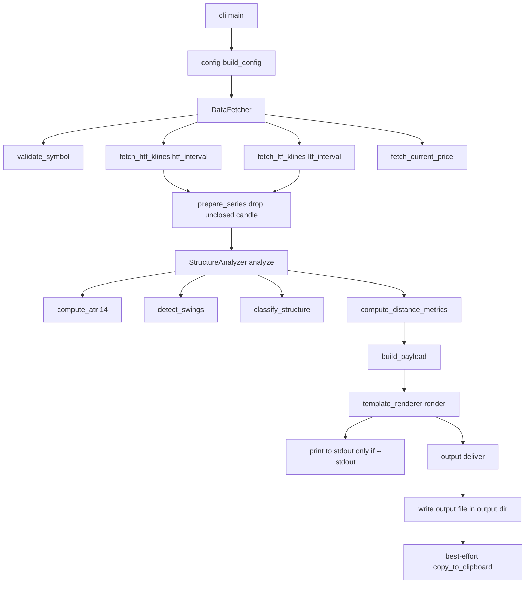

# SMC-Prompt — Design Specification

- **Artifact:** `docs/DESIGN_SPEC.md`
- **Tool:** `smc-prompt`
- **Status:** Design frozen for implementation (Code phase)
- **Scope of this document:** DESIGN ONLY. No production code is defined or generated here.
- **Target platform:** Python 3.10+, Windows / macOS / Linux

---

## 1. Executive Summary

`smc-prompt` is a single-run CLI that pulls OHLC data from the Binance public REST API (no API key), computes only **objective, mechanical structural facts** (the `[FAKTA]` layer), injects those facts into a fixed prompt template, writes the final prompt to a Markdown file, copies it to the system clipboard (best effort), and can optionally print it to stdout with `--stdout`.

The tool is a **data-preparation utility for a downstream text LLM**. It performs zero reasoning of its own. Every non-trivial interpretation (DOL, liquidity sweeps, bias, entry confirmation) is deliberately delegated to the LLM reading the rendered prompt.

### 1.1 The two-layer payload (critical design decision)

Swing extremes alone are **insufficient** for the template's section 4 (CHoCH / MSS / FVG / OB), because those patterns require the raw candle sequence, not just the extremes. Therefore the injected payload has **two layers**:

- **Layer A — Computed Summary:** current price, swing extremes (price + timestamp), mechanical structure classification, distance metrics, optional ATR(14), and **mechanical Fair Value Gaps** (3-candle price gaps + fill status — see §4.7).
- **Layer B — Raw Candle Table:** compact, token-efficient CSV blocks (HTF, MTF and LTF — default trio `1d` / `4h` / `1h`) so the LLM can derive OB and CHoCH/MSS (several prior swings) itself. FVG is now computed in Layer A (§4.7) rather than delegated here; the LLM may still cross-check it against the raw table.

---

## 2. HARD NON-GOALS (restated verbatim — downstream phases MUST enforce)

These are absolute scope boundaries. Any implementation that crosses one is a defect, not a feature.

- **NO LLM API calls of any kind** (zero cost beyond free Binance API bandwidth).
- **NO SMC/ICT reasoning:** must NOT compute Draw on Liquidity (DOL), must NOT narrate liquidity sweeps, must NOT assign trading bias. That remains the job of the text LLM on the other side.
- **NO image/vision processing whatsoever.**
- **NO order execution / auto-trading.**
- **If any implementation ambiguity tempts "just compute the bias too", that is scope creep — stop and return to `[FAKTA]` only.**

> **AMENDMENT (FVG — Phase 2).** The original non-goal "minimum 3-candle context
> for FVG is delegated to the LLM" (see §1.1 Layer B) is **narrowed**: mechanical
> **Fair Value Gap detection is now PERMITTED** because an FVG is a **purely
> mechanical 3-candle price gap derivable from OHLC alone** — bullish when
> `low[i] > high[i-2]`, bearish when `high[i] < low[i-2]` — with no interpretation
> required. It therefore belongs to the `[FAKTA]` layer (exactly like the
> mechanical swing/equal-level facts), unlike DOL/sweeps/bias which remain
> delegated to the LLM. Everything else in this section is **unchanged**: the tool
> must still NOT compute DOL, narrate sweeps, or assign bias. FVG is the **only**
> structural pattern promoted from Layer B (raw table) to Layer A (computed fact)
> in this phase; Order Block (OB) and CHoCH/MSS remain LLM-derived. See §4.7 for
> the mechanical definition and §8.3 for the rendered format.

### 2.1 Enforcement rules for the Code phase

1. The word **"bias"** MUST NOT appear anywhere in tool-generated output other than the untouched literal template text (where it is the LLM's deliverable). The mechanical field is named `structure_class` and its values are `Bullish` / `Bearish` / `Ranging/Mixed` / `Equal Highs/Lows` — never "bias".
2. The strings `DOL`, `Draw on Liquidity`, `liquidity sweep`, `stop hunt`, `SSL`, `BSL` MUST NOT be emitted by any module. They exist only inside the static template body, which is copied verbatim.
3. No module may import an LLM SDK, an image library (PIL/OpenCV), or an exchange trading client (spot/margin order APIs).
4. `data_fetcher.py` may only call **read-only public market-data endpoints** (klines, ticker/price, exchangeInfo). No signed/private endpoints.
5. **Data providers (Phase 6) may only call read-only public market-data endpoints.** `twelvedata_source.py` (`/time_series`, `/quote`) and `oanda_source.py` (`/v3/accounts`, `/v3/accounts/{id}/instruments`, `/v3/accounts/{id}/pricing`, `/v3/instruments/{i}/candles`) are **read-only**; no order, trade, or account-mutating route may ever be called. A credential grants read access to *data*, never the ability to trade — which keeps the "NO order execution / auto-trading" non-goal intact.

> **Note (3-tier extension).** Extending the pipeline from two native tiers
> (HTF + LTF) to three (HTF + MTF + LTF) **alters no non-goal** in this section.
> The MTF tier emits the same mechanical `[FAKTA]` family as HTF/LTF; the tool
> still performs zero reasoning, still never names `structure_class` as "bias",
> and FVG remains the only structural pattern promoted to Layer A.

---

## 3. Invocation & CLI Contract

```
smc-prompt <SYMBOL> [--htf-interval I] [--mtf-interval I] [--ltf-interval I]
           [--htf-candles N] [--mtf-candles N] [--ltf-candles N] [--swing-lookback N]
           [--input-csv FILE] [--htf-file FILE] [--mtf-file FILE] [--ltf-file FILE]
           [--max-prompt-bytes BYTES] [--dry-run]
```

Examples:

```
smc-prompt BTCUSDT
smc-prompt ETHUSDT --htf-candles 60 --mtf-candles 120 --ltf-candles 100
smc-prompt BTCUSDT --htf-interval 1d --mtf-interval 4h --ltf-interval 1h
smc-prompt BTCUSDT --input-csv candles.csv --mtf-file candles_4h.csv --ltf-file candles_1h.csv
```

| Argument | Required | Type | Default | Description |
|---|---|---|---|---|
| `SYMBOL` | yes | positional str | — | Binance Spot symbol, e.g. `BTCUSDT` (case-insensitive; normalized to uppercase) |
| `--htf-interval` | no | Binance interval | `1d` | Kline interval for the HTF series. One of `1m,3m,5m,15m,30m,1h,2h,4h,6h,8h,12h,1d,3d,1w,1M` (see §11) |
| `--mtf-interval` | no | Binance interval | `4h` | Kline interval for the MTF (medium) series. Same allowed set as `--htf-interval`. Must differ from the other two tiers |
| `--ltf-interval` | no | Binance interval | `1h` | Kline interval for the LTF series. Same allowed set as `--htf-interval`. Must differ from the other two tiers |
| `--htf-candles` | no | int >= 10 | `60` | Number of CLOSED `htf_interval` candles emitted in the HTF raw table |
| `--mtf-candles` | no | int >= 10 | `120` | Number of CLOSED `mtf_interval` candles emitted in the MTF raw table |
| `--ltf-candles` | no | int >= 10 | `100` | Number of CLOSED `ltf_interval` candles emitted in the LTF raw table |
| `--swing-lookback` | no | int (odd, >= 3) | `5` | Fractal window size in bars used for swing detection (see §6.2) |
| `--output-dir` | no | path | `./output` | Directory for the generated `.md` prompt file |
| `--stdout` | no | flag | off | Also print the prompt to stdout (off by default) |
| `--input-csv` | no | path | — | **Offline mode (Phase 4, #10).** Read local OHLCV candles from a CSV instead of Binance. Feeds ALL THREE timeframes unless overridden by `--htf-file` / `--mtf-file` / `--ltf-file`. The network path stays the default; offline mode is enabled ONLY when this flag is present (see §4.8). |
| `--htf-file` | no | path | — | Offline HTF candle CSV. Requires `--input-csv`; overrides the HTF series only. |
| `--mtf-file` | no | path | — | Offline MTF candle CSV. Requires `--input-csv`; overrides the MTF series only. |
| `--ltf-file` | no | path | — | Offline LTF candle CSV. Requires `--input-csv`; overrides the LTF series only. |
| `--max-prompt-bytes` | no | int | — | **Hard post-render size limit (Phase 5, #11).** When the rendered prompt exceeds this many UTF-8 bytes the tool aborts with `ConfigError` (exit 2) **before** anything is written. Off by default. |
| `--dry-run` | no | flag | off | **Dry run (Phase 5, #16).** Validate the config + symbol and print the resolved settings to stderr, then exit **without** fetching klines, rendering, or writing a file. Useful for CI / pre-flight checks. |
| `--provider` | no | choice | `binance` | **Data provider (Phase 6).** One of `binance` / `twelvedata` / `oanda`. Binance serves crypto only; the FX providers make XAUUSD analyzable (§3.9). |
| `--twelvedata-key` | no | str | env `TWELVEDATA_API_KEY` | Twelve Data API key. A missing key raises `ConfigError` (exit 2) before any request. |
| `--oanda-token` | no | str | env `OANDA_API_TOKEN` | OANDA v20 API token. A missing token raises `ConfigError` (exit 2). |
| `--oanda-account-id` | no | str | env `OANDA_ACCOUNT_ID` | Optional OANDA account id; auto-discovered from `/v3/accounts` when omitted. |
| `--oanda-env` | no | choice | `practice` | OANDA environment: `practice` (free demo) or `live` (funded account). |
| `--debug` | no | flag | off | Print stack traces; otherwise concise messages only |

**Output contract:** the final prompt text is **always written to `./output/<symbol>_<timestamp>.md`** (the primary artifact) and then **best-effort copied to the clipboard**. A clipboard failure (headless env) is downgraded to a warning on stderr and does not change the exit code; a failure to write the `.md` file raises `OutputError` (exit 6). By default stdout is **empty** so the stdout stream never risks a truncated paste; passing `--stdout` additionally prints the prompt text to stdout. All notes, warnings, and errors go to stderr.

---

## 3.9 Data providers (Phase 6) — XAUUSD and other FX/metals

### 3.9.1 Why Binance cannot serve XAUUSD

Binance Spot lists no fiat/forex/metal instruments. `GET /api/v3/exchangeInfo?symbol=XAUUSD`
returns an empty `symbols` array and `GET /api/v3/klines?symbol=XAUUSD` returns
HTTP 400, so both paths raise `SymbolNotFoundError` (exit 3). The failure is
**instrument-scoped, not host-scoped**, so `--base-url` cannot work around it.

The tokenized-gold proxies (`XAUTUSDT`, `PAXGUSDT`) are **not** an acceptable
substitute. They introduce a persistent peg premium/discount, a crypto
order-book microstructure, and a 24/7 session with no weekend gap — all of which
fabricate swings and FVGs that do not exist on the spot gold market. Analysing
them would violate the `[FAKTA]` contract the prompt asserts.

### 3.9.2 Provider abstraction

A provider is any class exposing the existing fetcher-parity seam
(`validate_symbol` / `fetch_klines` / `fetch_current_price` / `fetch_server_time`
/ `price_notes` / `with_now`). The analysis pipeline is **unchanged**: it already
consumes `Sequence[Candle]`. `provider_base.ProviderHttp` centralizes
retry/backoff + host failover, and `provider_base` also owns the shared
`price_within_band` / `price_sanity_warning` helpers so every network path
degrades identically.

| Provider | `--provider` | Instrument | `4h` native | Volume | Credential |
|---|---|---|---|---|---|
| Binance Spot | `binance` (default) | crypto | yes | real | none |
| Twelve Data | `twelvedata` | FX/metals (`XAU/USD`) | yes | `"0"` | `--twelvedata-key` / `TWELVEDATA_API_KEY` |
| OANDA v20 | `oanda` | FX/metals (`XAU_USD`) | yes | tick count | `--oanda-token` / `OANDA_API_TOKEN` |

Both FX providers serve `4h` natively, so the default `1d` / `4h` / `1h` trio maps
1:1 and no aggregation is performed.

### 3.9.3 Symbol and interval mapping

| Canonical | Twelve Data | OANDA |
|---|---|---|
| `XAUUSD` | `XAU/USD` | `XAU_USD` |
| `EURUSD` | `EUR/USD` (6-letter FX heuristic) | `EUR_USD` |
| `1d` / `4h` / `1h` | `1day` / `4h` / `1h` | `D` / `H4` / `H1` |

An interval a provider does not support raises `ConfigError` (exit 2).

`provider_base.aggregate_candles` exists for providers that lack a native tier
(open = first, high = max, low = min, close = last, volume = sum; the leading
partial bucket is dropped). It is **unused by the two providers shipped here**
because both serve `4h` natively.

### 3.9.4 Volume handling (critical correctness fix)

`config.volume_available` is `False` for both FX providers:

* **Twelve Data** reports `volume = "0"` for metals.
* **OANDA's candle "volume" is a tick count**, not trade volume. Rendering it in
  a column labelled `volume` would mislabel it as `[FAKTA]`, so the provider
  emits `0`.

When `volume_available` is `False`, `compute_relative_volume` returns `None` (the
facts render `n/a` / `spike: unknown`) **and** the zero-volume delisted heuristic
in `cli.run` is skipped. Without that second gate, every FX run would emit a
false `[smc-prompt] WARN: Latest <k> candles have zero volume; XAUUSD may be
delisted or halted`.

### 3.9.5 Price precision without `exchangeInfo`

Providers have no exchange metadata, so they synthesize the `PRICE_FILTER` entry
shape that `cli._extract_tick_size` already understands:

* Twelve Data: a `0.01` tick (2 dp, the metal convention).
* OANDA: the venue's own `displayPrecision` (`XAU_USD` is typically 3 dp).

This keeps price rendering on the existing tick-size code path rather than
falling back to the magnitude rule.

### 3.9.6 Timestamps, candle closure and the daily boundary

* OANDA emits 9-digit nanosecond fractions; `provider_base.iso_to_utc` truncates
  them to microseconds so Python 3.10's `datetime.fromisoformat` can parse them.
* OANDA's `complete` flag is **authoritative** for candle closure; the host-clock
  comparison is only a fallback when the field is absent.
* Only Binance exposes an exchange clock. The FX providers return the host clock
  from `fetch_server_time` by design (documented behaviour, not a warning
  condition), so `GENERATED_AT_UTC` and closure rest on the host clock there.
* **Spot gold's daily candle closes at 17:00 ET, not 00:00 UTC.** Daily swing
  timestamps and the EQH/EQL tolerance window therefore differ from crypto. This
  is intended: correct data for the correct instrument.

### 3.9.7 Provider-agnostic provenance

The prompt's provenance line must name the source that actually produced the
data. Rather than fork the byte-frozen template, `{{provider}}` is a **render
variable** (like `INCLUDE_ATR`), supplied by `template_renderer.render`:

* `render(payload, include_atr, provider_name="Binance")` renders the template
  once, passing the provider label as a render variable. It is deliberately
  **not** a payload placeholder, because the unresolved-placeholder guard only
  reports names present in the payload (so a provider name containing `{{` / `}}`
  cannot false-positive).
* The default `"Binance"` reproduces the original wording byte for byte, which is
  why the frozen `GOLDEN_SHA256` / `GOLDEN_BYTES` are **unchanged** by this phase.

---

## 4. Data Source & Structural Processing

### 4.1 Binance usage

| Purpose | Endpoint | Interval/Param |
|---|---|---|
| HTF candles | `GET /api/v3/klines` | `interval=htf_interval` (default `1d`), `limit=htf_fetch_limit` |
| MTF candles | `GET /api/v3/klines` | `interval=mtf_interval` (default `4h`), `limit=mtf_fetch_limit` |
| LTF candles | `GET /api/v3/klines` | `interval=ltf_interval` (default `1h`), `limit=ltf_fetch_limit` |
| Current price | `GET /api/v3/ticker/price` | `symbol=<SYMBOL>` |
| Symbol validation (+ `tickSize`, `status`) | `GET /api/v3/exchangeInfo` | `symbol=<SYMBOL>` |
| Server time | `GET /api/v3/time` | none |

- No API key. Base host configurable (`https://api.binance.com`), with fallback documented in §11 (region blocks).
- **Providers (Phase 6).** The Binance endpoints above are the default path.
  Selecting `--provider twelvedata` or `--provider oanda` swaps in a read-only
  FX/metals source that shares the same public shape, so §4.2–§4.9 (swings,
  structure, ATR, FVG, distances, volume) are unchanged. See §3.9 for the provider
  contract, symbol/interval mapping, the volume-availability gate, synthetic
  `tickSize`, and timestamp notes.
- **Offline mode (Phase 4, #10).** Passing `--input-csv` (with optional
  `--htf-file` / `--mtf-file` / `--ltf-file`) switches the data source to the local
  `smc_prompt/csv_source.py` reader and performs **zero network access**. See
  §4.8 for the schema and semantics. The fetcher (and thus the default network
  path) is unchanged.
- `hl` klines return 12-tuples; we consume indices `[0]=openTime, [1]=open, [2]=high, [3]=low, [4]=close, [5]=volume, [6]=closeTime`.
- All timestamps are UTC (Binance klines are UTC by default).
- **Server time (Phase 3).** The exchange clock is fetched once
  (`GET /api/v3/time`) and used as the `now` reference for the closure decision
  (§4.3) and `GENERATED_AT_UTC`, so a skewed host clock cannot mark a half-open
  candle as closed. On failure the tool falls back to the host clock and emits a
  WARN. The fetcher's injectable `now=` seam is threaded with the server instant.
- **`tickSize` + status (Phase 3).** The `exchangeInfo` entry is retained:
  `PRICE_FILTER.tickSize` drives the price-formatter precision (§8.1) and the
  entry `status` is surfaced as a non-fatal warning when it is not `TRADING`.
- **Rate limit:** near-irrelevant for a single-run CLI, but retry-with-backoff is still implemented (§9.4).

### 4.2 Swing Detection — method evaluation and DECISION

Three candidate methods were evaluated against the four mandatory criteria.

| Criterion | N-bar Fractal (Williams, N=5) | ZigZag (% or ATR threshold) | Classic Pivot Points |
|---|---|---|---|
| Deterministic & reproducible | Excellent — pure fixed-window comparison, no recursion, no hidden state | Fair — recursive leg construction; tie-breaking near-equal extremes is implementation-sensitive; the last leg can appear to "repaint" as new bars arrive | Excellent — fixed left/right windows |
| Parameterizable | Good — single integer `N`; larger `N` = fewer, more significant swings | Good — threshold (`%` or `ATR` multiple) tunes sensitivity | Good — left/right bar counts |
| Noise-resistant | Medium — `N=5` still fires on shallow sideways chop | Good — threshold inherently filters chop | Medium |
| Computationally cheap | Excellent — O(n) single pass | Excellent — O(n) | Excellent — O(n) |

**DECISION — Chosen method: N-bar Williams Fractal (default N = 5), augmented with an optional ATR separation filter.**

Rationale:

1. **Determinism is the top priority** because the tool's contract is "same input → same output, no randomness/hidden state." The fractal is a pure fixed-window argmax/argmin — trivially provable, unlike ZigZag's recursive leg construction whose tie-breaking is the most likely source of reproducibility bugs. This alone outweighs ZigZag's noise advantage.
2. **Fractal swings match the SMC concept** of a "swing high/low" better than pivots, and the `N=5` Williams default is the de-facto industry baseline.
3. **Noise resistance is recovered** by a deterministic post-filter: fractals that are not separated from the prevailing extreme by at least `swing_merge_atr_mult × ATR(14)` are merged/discarded, keeping the more extreme one. This preserves strict determinism while suppressing micro-swing spam.
4. **Parameterization** is exposed through `--swing-lookback N` (fractal window) and `swing_merge_atr_mult` in config.

Trade-offs accepted (and disclosed to the LLM via the raw candle table):

- The **most recent `half = (N-1)/2` closed bars can never be a swing** (they lack right-side context). So the newest detectable swing is at least 2 daily / 2 hourly bars old. This is acceptable and is a known limitation (§11).
- A trivial stray tick can create a shallow fractal; the ATR filter mitigates but does not fully eliminate this.

**Default parameters chosen:**

| Param | Default | Unit | Semantics |
|---|---|---|---|
| `swing_lookback` (fractal `N`) | `5` | bars (odd) | Total window size; half-width each side = 2 |
| `swing_merge_atr_mult` | `0.5` | × ATR(14) | Minimum separation between consecutive same-type swings; closer ones are merged |
| `equal_levels_atr_mult` | `0.1` | × ATR(14) | Tolerance for it being the *same* level (equal highs/lows pools, and the HH/HL/LH/LL vs EQH/EQL label derivation) |
| `atr_period` | `14` | bars | Lookback for ATR in both timeframes |

**Alternating skeleton (post-pass).** The ATR merge only compares a candidate
against the last *same-type* swing and can `pop()`+`append()`, which may leave
consecutive same-type swings (`H,H,L,L`). A deterministic O(n) post-pass
(`enforce_alternation`) collapses every run of consecutive same-type swings to
the single most extreme one (max price for HIGH, min price for LOW; first-seen
wins on exact ties). The resulting genuine alternating `H/L/H/L` skeleton is what
classification, reference selection, equal-level detection and the rendered swing
table all consume.

### 4.3 Handling the not-yet-closed candle

The final candle of the fetched series (whose close time is still in the future relative to request time) is **excluded from all swing / ATR / structure / table computations**. It is used **only** to derive "current price" if the ticker endpoint is unavailable.

Concrete rule: `is_closed = (now_utc >= kline.closeTime + 1s)`, where
`now_utc` is the **Binance server time** fetched once via `GET /api/v3/time`
and injected through the fetcher's `now=` seam (host-clock fallback with a WARN
when server time is unavailable; see §4.1, §9.3). Emit only closed candles
downstream.

### 4.4 Structure classification (mechanical — NOT "bias")

From the ordered sequence of detected swings:

- **Bullish** = the most recent two swing highs form a Higher High **and** the most recent two swing lows form a Higher Low.
- **Bearish** = the most recent two swing highs form a Lower High **and** the most recent two swing lows form a Lower Low.
- **Equal Highs/Lows** = the last two same-type highs are within `equal_levels_atr_mult × ATR(14)` of each other **and** the last two same-type lows are too. This is the textbook liquidity pool, a *distinct* fact — it is deliberately **not** folded into `Ranging/Mixed`.
- **Ranging/Mixed** = anything else, or fewer than 2 highs / 2 lows available.

This is a `[MEKANIS FAKTA]` numeric comparison. Output field is `structure_class`
with values `Bullish` / `Bearish` / `Ranging/Mixed` / `Equal Highs/Lows`. Never
labeled "bias". The equal-levels term is only applied when ATR is available.

### 4.4a Equal highs / equal lows (liquidity pool facts)

`detect_equal_levels(swings, tol)` clusters same-type swings whose prices lie
within `tol = equal_levels_atr_mult × ATR(14)`. It scans swings chronologically:
a swing joins the open cluster when its price is within `tol` of the cluster's
running most-extreme representative; otherwise the cluster closes and a new one
opens. Only clusters of size >= 2 are emitted, in chronological order, as
`(representative price, count)`. Deterministic, no lookahead.

### 4.5 Distance metrics & reference levels

For a reference swing `S` and current price `C`:

- `dist_abs = C - S.price` (signed) — positive when `C` is above `S`.
- `dist_pct = (C - S.price) / S.price × 100` — signed, 2 decimals.

Rendered as `"{sign}{pct:.2f}% ({sign}{abs})"`, e.g. `-7.72% (-5280.00)`.

**Reference swing choice (explicit decision).** Instead of a single ambiguous
reference, the payload now emits **all three** reference levels per timeframe:

1. **recent** — most-recent swing by timestamp.
2. **nearest** — swing with the smallest absolute price distance to current price.
3. **window extreme** — the max high (or min low) within the emitted swing window
   (the last `swings_table_rows` swings actually rendered).

The *reported* `--distance-reference` swing (default `nearest`) is whichever of
`recent` / `nearest` the selected mode names; its status is carried through those
fields. Each reference string includes the price, the date/datetime, an explicit
direction word relative to current price (`DI ATAS harga` / `DI BAWAH harga` /
`DI HARGA SAAT INI`) and a `[FAKTA]` breach status token.

**Level breach status.** `compute_level_status(candles, level, swing_type)`
operates on the closed candle series: a high is `swept` when any later closed
candle prints a high strictly above the level; a low is `swept` when any later
closed candle prints a low strictly below it; otherwise `untested`. Mechanical,
deterministic, no lookahead.

**Reference sanity warnings.** `reference_sanity_warnings(analysis, config)`
returns mechanical contradiction strings (wired into `cli.run()`'s existing
warning list; empty when consistent): `Bullish` while the nearest low is already
above current price (a broken/mislabeled level), or `Bearish` while the nearest
high is already below current price. These are non-fatal `[smc-prompt] WARN:`
lines — the prompt still renders the raw facts.

### 4.6 ATR(14) — optional nice-to-have, INCLUDED in MVP

ATR is cheap and improves the LLM's contextual read, so it is in the MVP payload (not deferred). Computation uses the classic True Range with simple-mean smoothing over the last `atr_period` closed candles:

```
TR[0] = high[0] - low[0]
TR[i] = max(high[i]-low[i], |high[i]-close[i-1]|, |low[i]-close[i-1]|)
ATR   = mean(TR[last atr_period values])
```

Simple mean (not Wilder) is chosen for reproducibility transparency and easy verification.

### 4.7 Mechanical Fair Value Gaps (FVG) — `[FAKTA]` (Phase 2)

A Fair Value Gap is a **purely mechanical 3-candle price gap**, derivable from
OHLC alone with **zero interpretation**, so it is admitted into the `[FAKTA]`
layer (see the §2 amendment). `detect_fvg(candles, min_gap_atr_mult, *, atr_value)`
scans the closed series once:

- **Bullish FVG** at candle `i` when `low[i] > high[i-2]`; range
  `[lower, upper] = [high[i-2], low[i]]`.
- **Bearish FVG** at candle `i` when `high[i] < low[i-2]`; range
  `[lower, upper] = [high[i], low[i-2]]`.

Each detected FVG captures the price range (`lower`/`upper`), the direction
(`bullish`/`bearish`), the **birth timestamp** (the 3rd candle's open time) and a
`filled` flag. **Sub-noise filter:** gaps narrower than
`fvg_atr_mult × ATR(14)` (default `0.1`) are discarded — the same
ATR-fraction pattern used by `equal_levels_atr_mult`.

**Fill status.** A bullish FVG is `filled` when any **later closed** candle's
`low <= lower`; a bearish FVG is `filled` when any later closed candle's
`high >= upper`. Mechanical, closed-series only, no lookahead beyond the
3-candle window, no I/O, deterministic.

The newest `fvg_table_rows` (default `8`) gaps per timeframe are rendered as a
fenced block inside template §4 (see §8.3); the literal `NONE` is emitted when
none exist.

### 4.8 Offline / local CSV input mode (Phase 4, #10)

The tool can run **without any network access** by reading local OHLCV CSV
files. This is implemented in `smc_prompt/csv_source.py` as
`LocalCsvSource`, a **fetcher-parity** data source exposing the same public
shape as `DataFetcher` (`validate_symbol` / `fetch_klines` /
`fetch_current_price` / `fetch_server_time` / `price_notes` / `with_now`). The
analysis pipeline is **not** changed: it already consumes `Sequence[Candle]`.

**Activation.** Offline mode is enabled **only** by `--input-csv` (optionally
refined by `--htf-file` / `--mtf-file` / `--ltf-file`). The network path remains
the default; any `*-file` without `--input-csv` raises `ConfigError` (exit 2).
`--input-csv` alone feeds ALL THREE timeframes; each `*-file` overrides one
series.

**CSV schema** (one file per timeframe, header row required):

```
open_time,open,high,low,close,volume[,close_time]
```

| Column | Required | Format |
|---|---|---|
| `open_time` | yes | ISO-8601 UTC (`2026-07-15T00:00:00Z` / `... +00:00` / `2026-07-15 00:00` / `2026-07-15`); a pure-integer value is treated as **epoch milliseconds** |
| `open` | yes | decimal string (`Decimal`) |
| `high` | yes | decimal string |
| `low` | yes | decimal string |
| `close` | yes | decimal string |
| `volume` | yes | decimal string (rendered via `fmt_volume`, byte-stable) |
| `close_time` | no | same timestamp rules as `open_time`; when absent it is derived as `open_time + delta`, where `delta` is the first positive spacing between consecutive `open_time` values |

Column names are matched case-insensitively; extra columns are ignored; rows are
sorted chronologically before analysis. Every row is treated as **already
closed** (an offline snapshot *is* closed history), which keeps the offline
render fully deterministic and independent of the host clock.

**Determinism.** `fetch_server_time()` returns `max(close_time) + 1s` across the
three supplied files, so `GENERATED_AT_UTC` (and thus the output filename) is a
pure function of the input data. `fetch_current_price()` returns the last
*closed* LTF candle's close (no ticker endpoint offline). `validate_symbol()`
returns a synthetic entry (`status="TRADING"`, no `PRICE_FILTER`), so the
caller's tick-size/status handling degrades cleanly to the magnitude-bucketed
price rule with no spurious warnings.

**Interval coupling.** Offline mode requires three DISTINCT intervals
(`--htf-interval`, `--mtf-interval`, `--ltf-interval`), so each CSV maps to
exactly one timeframe. This rule is enforced in `build_config` (both modes) and
retained as a defense-in-depth guard in `LocalCsvSource.__init__`; a duplicate
trio raises `ConfigError` (exit 2).

**Malformed input.** A missing file, missing required column, empty body, or an
unparseable timestamp/number raises `ConfigError` (exit 2) with the offending
file and line number. Offline mode never calls the network.

> The committed offline fixtures under `tests/fixtures/` (plus the golden render
> hash in `tests/test_golden_render.py`) let template changes be regenerated and
> reviewed **byte-for-byte** without live candles.

### 4.9 Volume-derived signals (Phase 5, #16)

Two mechanical, interpretation-free volume facts are added to Layer A, reusing
the already-fetched `volume` field (no new endpoint, no extra network cost):

- **Relative volume** — `last / mean(window)` where `window` is the last
  `volume_mean_period` (default `20`) closed candles. Computed in
  `structure_analyzer.compute_relative_volume(candles, period, spike_mult)` as a
  `VolumeMetrics` dataclass and quantized to 4 decimals for byte-stability.
- **Volume-spike flag** — `is_spike = relative >= volume_spike_mult`
  (default `1.5`). Rendered as the ASCII tokens `yes` / `no` (and `unknown`
  when metrics are unavailable).

Guards (deterministic, non-fatal):

- Fewer than 2 closed candles → `None` (no volume line value; renders `n/a`).
- A zero mean (all-zero window, e.g. a halted/delisted symbol) → `relative = 0`
  so no divide-by-zero ever occurs; `is_spike` is then `False`.

Both facts are surfaced via the `*_VOLUME_RELATIVE` / `*_VOLUME_SPIKE`
placeholders (§8.2, §10) and rendered as a single bullet each per timeframe. The
relative value uses `config.fmt_relative_volume` → `x{value:.2f}`, so the
byte-stable render shows e.g. `x1.05`.

---

## 5. Final Module Structure

Revised from the initial proposal. Changes are annotated and justified.

```
smc_prompt/
├── __init__.py            # package version constant
├── __main__.py            # enables `python -m smc_prompt`
├── cli.py                 # Click entrypoint + orchestration only
├── config.py              # immutable defaults, interval strings, formatting rules
├── models.py              # dataclasses / typed payload contracts
├── errors.py              # exception hierarchy (drives exit codes)
├── data_fetcher.py        # Binance REST client (klines, ticker, exchangeInfo) + retry/backoff
├── csv_source.py          # offline/local CSV data source (fetcher-parity, network-free) [#10]
├── provider_base.py       # shared provider scaffolding: HTTP retry/failover, timestamps,
│                          #   aggregation, price-band helpers [#Phase 6]
├── twelvedata_source.py   # Twelve Data FX/metals source (XAU/USD, 4h native) [#Phase 6]
├── oanda_source.py        # OANDA v20 source (XAU_USD, H4 native, complete flag) [#Phase 6]
├── structure_analyzer.py  # swing detection, classification, distance, ATR
├── template_renderer.py   # build placeholder dict + Jinja2 render
├── output.py              # write .md output file + best-effort clipboard (renamed)
└── templates/
    └── prompt_template.j2 # Appendix A template as a Jinja2 asset

tests/                     # pytest suite (network-free) [#15]
├── conftest.py            # shared fixtures + deterministic candle helpers
├── test_golden_render.py  # offline CSV -> byte-frozen render hash/contract
├── test_csv_source.py     # CSV schema, fetcher parity, CLI wiring
├── test_structure_analyzer.py  # swings/classification/distance/FVG/etc.
└── fixtures/
    ├── generate_fixtures.py  # deterministic CSV fixture generator
    ├── htf_daily.csv         # committed HTF fixture (1d)
    └── ltf_hourly.csv        # committed LTF fixture (1h)
```

### 5.1 Justified revisions to the proposal

| Change | Justification |
|---|---|
| `clipboard.py` → `output.py` | A top-level module named `clipboard.py` risks shadowing / colliding with the real PyPI `clipboard` package and is a well-known import-hazard. `output.py` also owns the `.md` output-file path, so the name is more accurate. |
| Added `models.py` | Typed boundaries (`Candle`, `Swing`, `StructureResult`, `Payload`) make the two-layer payload contract explicit and independently testable. |
| Added `errors.py` | Centralizes the error taxonomy (§9) so exit codes map 1:1 to exception types. |
| Added `__main__.py` | Supports `python -m smc_prompt` in addition to the `smc-prompt` console script. |
| Added `templates/` asset dir | Keeps the Appendix A template byte-frozen outside Python source, so edits are diff-visible and the Code phase cannot accidentally mangle it. |

### 5.2 Dependency direction (acyclic)

```
config.py ─┐
models.py ─┼─> data_fetcher.py ─┐
errors.py ─┘  csv_source.py ────┼─> cli.py
            structure_analyzer.py ┤
            template_renderer.py ─┤
            output.py ────────────┘
```

- `config`/`models`/`errors` are leaf modules with no intra-package deps.
- `data_fetcher`, `csv_source`, `structure_analyzer`, `template_renderer`, `output` depend only on leaves.
- `csv_source` and `data_fetcher` are interchangeable data sources with the same public shape (`validate_symbol` / `fetch_klines` / `fetch_current_price` / `fetch_server_time` / `price_notes` / `with_now`); the analysis pipeline consumes `Sequence[Candle]` and does not know which one produced it.
- `cli.py` is the sole orchestrator and the only module that writes to stdout/stderr or sets exit codes.

---

## 6. CLI → Module Call Flow

### 6.1 Numbered sequence

1. `cli.main()` — Click parses argv → `symbol`, `htf_interval`, `ltf_interval`, `htf_candles`, `ltf_candles`, `swing_lookback`, `output_dir`, `stdout`, `debug`.
2. `config.build_config(argv)` → `Config` (validates ranges: `swing_lookback` is odd and >= 3; candle counts >= 10; both intervals ∈ `BINANCE_INTERVALS`; computes `htf_fetch_limit` / `ltf_fetch_limit` = requested table size + context buffer, capped at 1000).
3. Data source selection: `DataFetcher(config)` is the **default**; when
   `--input-csv` is supplied, `csv_source.LocalCsvSource(config, ...)` is used
   instead. Both expose the same public shape, so steps 3a–3d below are
   source-agnostic. `DataFetcher(config).run()`:
   1. `validate_symbol(symbol)` — `exchangeInfo`; raises `SymbolNotFoundError` on miss.
   2. `fetch_htf_klines(config.htf_interval, htf_fetch_limit)` → `list[Candle]`.
   3. `fetch_ltf_klines(config.ltf_interval, ltf_fetch_limit)` → `list[Candle]`.
   4. `fetch_current_price(symbol)` → `Decimal` (falls back to close of last closed LTF candle if ticker fails).
4. `structure_analyzer.prepare_series(htf)` / `(ltf)` → drops the unclosed candle; raises `InsufficientDataError` if too few closed bars; emits `DelistedWarning` if the latest bars are all zero-volume (non-fatal).
5. `structure_analyzer.analyze(series, config)` per timeframe:
   1. `compute_atr(series, 14)`.
   2. `detect_swings(series, n=swing_lookback, atr, merge_mult)` then `enforce_alternation` (alternating skeleton).
   3. `classify_structure(swings, config, atr_value)`.
   4. `detect_equal_levels(swings, equal_levels_atr_mult × ATR)`.
   5. `detect_fvg(closed, fvg_atr_mult, atr_value=ATR)` — mechanical 3-candle FVGs + fill status (§4.7).
   6. `compute_distance_metrics(current_price, swings)` + `build_reference_facts(...)` + `compute_level_status(...)`.
   7. `cli` collects `reference_sanity_warnings(analysis, config)` into its warning list.
6. `template_renderer.build_payload(pair, generated_at, htf_result, ltf_result, htf_candles, ltf_candles, config)` → `dict[str,str]`.
7. `template_renderer.render(payload)` → final prompt string.
8. `cli` prints the prompt to stdout **only when `--stdout` was passed** (stdout stays empty by default).
9. `output.deliver(prompt_text, symbol, output_dir)`:
   1. `write_output_file(...)` to `./output/<symbol>_<timestamp>.md` (always); if it fails → `OutputError` (exit 6).
   2. `copy_to_clipboard(text)` via `pyperclip`; on failure the `ClipboardUnavailable` signal is downgraded to a warning (exit stays 0).
10. `cli` returns exit code 0 (or the mapped error code on any exception).

### 6.2 Flow diagram



---

## 7. Pseudocode (deliverable 3)

### 7.1 Swing detection

```
FUNCTION detect_swings(series, n, atr_value, merge_mult):
    # series: list[Candle] of CLOSED candles, chronological ascending
    # n: fractal window (odd, >= 3)
    ASSERT n % 2 == 1 and n >= 3
    half = (n - 1) // 2

    raw = []   # list of Swing(index, ts, price, type)

    FOR i FROM half TO len(series) - half - 1:
        window = series[i - half .. i + half]      # inclusive, has n candles
        center = series[i]

        is_high = center.high > MAX(w.high FOR w IN window WHERE w != center)
                  # STRICT '>' so equal highs do NOT both qualify -> deterministic, no ties
        is_low  = center.low  < MIN(w.low  FOR w IN window WHERE w != center)

        IF is_high:
            raw.APPEND(Swing(i, center.open_time, center.high, HIGH))
        ELSE IF is_low:
            raw.APPEND(Swing(i, center.open_time, center.low, LOW))
        # a candle is never both under strict comparison on real OHLC data

    # ATR separation filter (deterministic post-pass)
    filtered = []
    FOR s IN raw:                                  # already chronological
        last_same = LAST element of filtered with same type as s
        IF last_same EXISTS and |s.price - last_same.price| < (merge_mult * atr_value):
            IF s is MORE EXTREME than last_same:   # higher high or lower low
                REMOVE last_same from filtered
                filtered.APPEND(s)
            ELSE:
                SKIP s                             # keep the prior, more significant swing
        ELSE:
            filtered.APPEND(s)

    RETURN enforce_alternation(filtered)           # genuine H/L/H/L skeleton

FUNCTION enforce_alternation(swings):              # O(n), no recursion/lookahead
    result = []
    FOR s IN swings:
        IF result NOT EMPTY and result[-1].type == s.type:
            IF s is MORE EXTREME than result[-1]:
                result[-1] = s                     # replace run representative
            # else: keep existing representative (first-seen wins on ties)
        ELSE:
            result.APPEND(s)
    RETURN result
```

Guarantees: no randomness, no recursion, no lookahead beyond the window, O(n).

### 7.2 Structure classification

```
FUNCTION classify_structure(swings, config, atr_value):
    IF len(swings) < config.structure_min_swings:   # default 4
        RETURN "Ranging/Mixed"

    recent = LAST config.structure_last_swings OF swings   # default 6, chronological
    highs = [s FOR s IN recent IF s.type == HIGH]
    lows  = [s FOR s IN recent IF s.type == LOW]

    IF len(highs) < 2 OR len(lows) < 2:
        RETURN "Ranging/Mixed"

    hh = highs[-1].price > highs[-2].price
    hl = lows[-1].price  > lows[-2].price
    lh = highs[-1].price < highs[-2].price
    ll = lows[-1].price  < lows[-2].price

    IF atr_value IS NOT NULL:
        tol = config.equal_levels_atr_mult * atr_value
        IF |highs[-1].price - highs[-2].price| <= tol
           AND |lows[-1].price - lows[-2].price| <= tol:
            RETURN "Equal Highs/Lows"     # distinct liquidity-pool fact

    IF hh AND hl: RETURN "Bullish"
    IF lh AND ll: RETURN "Bearish"
    RETURN "Ranging/Mixed"       # mixed/contradictory sequence
```

### 7.3 Distance metrics

```
FUNCTION compute_distance_metrics(current_price, swings):
    last_high = LAST swing of type HIGH
    last_low  = LAST swing of type LOW
    dist_high = fmt_distance(current_price, last_high.price)
    dist_low  = fmt_distance(current_price, last_low.price)
    RETURN { high: last_high, low: last_low, dist_high, dist_low }

FUNCTION fmt_distance(current, ref):
    abs_val = current - ref
    pct     = (abs_val / ref) * 100
    sign    = "+" IF abs_val >= 0 ELSE "-"
    RETURN sign + FORMAT(ABS(pct), 2dp) + "% (" + sign + FORMAT(ABS(abs_val), price_dp) + ")"
```

---

## 8. Payload Text Formats (deliverable 4)

### 8.1 Formatting primitives (must be byte-stable)

- **Encoding:** UTF-8. **Line separator:** `\n` (LF) only. **No trailing whitespace** on any line. File/stdout ends with exactly one `\n`.
- **Money/price `fmt_price(x)`:** precision is **derived from the symbol's `PRICE_FILTER.tickSize`** (`config.decimals_from_tick_size`, e.g. `0.01000000` → 2 dp, `0.00000100` → 6 dp, `1.00000000` → 0 dp), capped at 8 dp. This is bound once per run into a `config.PriceFormat` and threaded through every price-rendering path (tables, swings, equal levels, FVG ranges, reference levels, distances). When the tick is unavailable/unparseable the formatter falls back to the original magnitude-bucketed rule — `x >= 1000` → 2 dp; `1 <= x < 1000` → 4 dp; `x < 1` → 8 dp — which is also the documented behaviour for a missing `exchangeInfo`. Both paths are deterministic; for the frozen BTCUSDT sample the tick-derived precision (2 dp) equals the magnitude rule for every rendered value, so the artifact is byte-identical.
- **Percent:** always 2 dp, explicit sign.
- **Volume `fmt_volume(x)`:** plain `format(Decimal(str(x)), "f")` of the raw kline volume — reproduces the source digit sequence with no float rounding and no magnitude-dependent formatting. This is the byte-stable rule for the new `volume` column.
- **HTF date:** `%Y-%m-%d` (UTC).
- **LTF datetime:** `%Y-%m-%d %H:%M` (UTC).
- **Swing label:** one of `HH` / `HL` / `LH` / `LL` / `EQH` / `EQL` / `-` (single ASCII token; `-` for the first swing of a given type).
- **`GENERATED_AT_UTC`:** `%Y-%m-%dT%H:%M:%SZ`.
- **CSV rows:** comma-separated, no spaces, no header row inside the block. Numeric fields use `fmt_price` (volume uses `fmt_volume`).

### 8.2 Layer A — Computed Summary (feeds placeholders)

```
PAIR                      -> BTCUSDT
GENERATED_AT_UTC          -> 2026-09-13T08:09:34Z
CURRENT_PRICE             -> 63120.00
HTF_STRUCTURE_CLASS       -> Ranging/Mixed
HTF_SWING_HIGH            -> 68400.00
HTF_SWING_HIGH_DATE       -> 2026-08-20
HTF_DIST_TO_HIGH          -> -7.72% (-5280.00)
HTF_SWING_LOW             -> 58200.00
HTF_SWING_LOW_DATE        -> 2026-09-01
HTF_DIST_TO_LOW           -> +8.45% (+4920.00)
HTF_ATR14                 -> 1850.00
HTF_CANDLE_COUNT          -> 60
ATR_PCT_OF_PRICE          -> 2.93% of price
HTF_DIST_TO_HIGH_ATR      -> x2.85
HTF_DIST_TO_LOW_ATR       -> x2.66
HTF_VOLUME_RELATIVE       -> x1.05
HTF_VOLUME_SPIKE          -> no
HTF_EQUAL_HIGHS           -> NONE
HTF_EQUAL_LOWS            -> 58200.00 (2 swings)
HTF_REF_HIGH_RECENT       -> 63450.00 pada 2026-09-12 (DI ATAS harga), status: untested
HTF_REF_LOW_RECENT        -> 62100.00 pada 2026-09-10 (DI BAWAH harga), status: swept
HTF_REF_HIGH_NEAREST      -> 63450.00 pada 2026-09-12 (DI ATAS harga), status: untested
HTF_REF_LOW_NEAREST       -> 62100.00 pada 2026-09-10 (DI BAWAH harga), status: swept
HTF_REF_HIGH_WINDOW_MAX   -> 68400.00 pada 2026-08-20 (DI ATAS harga), status: swept
HTF_REF_LOW_WINDOW_MIN    -> 58200.00 pada 2026-09-01 (DI BAWAH harga), status: untested
LTF_STRUCTURE_CLASS       -> Bearish
LTF_SWING_HIGH            -> 63450.00
LTF_SWING_HIGH_DATE       -> 2026-09-12 14:00
LTF_DIST_TO_HIGH          -> -0.52% (-330.00)
LTF_SWING_LOW             -> 62100.00
LTF_SWING_LOW_DATE        -> 2026-09-12 22:00
LTF_DIST_TO_LOW           -> +1.64% (+1020.00)
LTF_ATR14                 -> 145.00
LTF_CANDLE_COUNT          -> 100
LTF_DIST_TO_HIGH_ATR      -> x2.28
LTF_DIST_TO_LOW_ATR       -> x7.03
LTF_VOLUME_RELATIVE       -> x0.95
LTF_VOLUME_SPIKE          -> no
LTF_EQUAL_HIGHS           -> NONE
LTF_EQUAL_LOWS            -> NONE
LTF_REF_HIGH_RECENT       -> 63450.00 pada 2026-09-12 14:00 (DI ATAS harga), status: untested
LTF_REF_LOW_RECENT        -> 62100.00 pada 2026-09-12 22:00 (DI BAWAH harga), status: swept
LTF_REF_HIGH_NEAREST      -> 63120.00 pada 2026-09-12 08:00 (DI ATAS harga), status: untested
LTF_REF_LOW_NEAREST       -> 63010.00 pada 2026-09-12 09:00 (DI BAWAH harga), status: swept
LTF_REF_HIGH_WINDOW_MAX   -> 63450.00 pada 2026-09-12 14:00 (DI ATAS harga), status: untested
LTF_REF_LOW_WINDOW_MIN    -> 62100.00 pada 2026-09-12 22:00 (DI BAWAH harga), status: swept
```

Reference string shape (byte-stable): `<price> pada <stamp> (<direction word>),
status: <swept|untested>` where `<direction word>` ∈ `DI ATAS harga` /
`DI BAWAH harga` / `DI HARGA SAAT INI`. Equal-level string shape:
`<price> (<n> swings)` joined by `; ` in chronological order, or the literal `NONE`.

**Three tiers (3-tier extension).** Layer A now carries the same computed-summary
family for all THREE tiers in descending-timeframe order (HTF → MTF → LTF), i.e.
the `HTF_*` block above is mirrored by an `MTF_*` block followed by the existing
`LTF_*` block. The MTF tier is a third instance through the **unchanged**
`analyze()` pipeline; `TimeframeAnalysis` is not modified. `MTF_SWING_*_DATE`
strings use the **datetime** stamp (`%Y-%m-%d %H:%M`), like LTF, because MTF sits
below the HTF tier.

`ATR_PCT_OF_PRICE` remains a **single pair-level fact bound to the HTF ATR** (the
macro volatility scale); no `MTF_ATR_PCT_OF_PRICE` / `LTF_ATR_PCT_OF_PRICE` is
emitted. Per-tier volatility context is still available via `HTF_ATR14` /
`MTF_ATR14` / `LTF_ATR14` and the per-tier ATR-normalized distances.

### 8.3 Layer B — Raw Candle Tables

The payload carries THREE raw candle tables, one per native tier:

- HTF format, exactly `HTF_CANDLE_COUNT` lines, one per closed HTF candle,
  oldest → newest (date stamp):
- MTF format, exactly `MTF_CANDLE_COUNT` lines, one per closed MTF candle,
  oldest → newest (datetime stamp):
- LTF format, exactly `LTF_CANDLE_COUNT` lines, one per closed LTF candle,
  oldest → newest (datetime stamp):

```
YYYY-MM-DD,O,H,L,C,V            (HTF)
YYYY-MM-DD HH:MM,O,H,L,C,V      (MTF and LTF)
```

No header, no index column, no ellipsis line. The `volume` column is appended
after `close` using `fmt_volume`. Column order is documented by a one-line legend
in the section prose (`Format kolom: tanggal,...` for HTF, `Format kolom:
datetime,...` for MTF and LTF) rather than a header row. If fewer closed candles
exist than requested, the table is emitted at the reduced count and
`*_CANDLE_COUNT` matches the actual count (see §9, edge case "insufficient
history").

**Fair Value Gap table (Layer A addition — Phase 2).** Emitted as a fenced block
inside template §4 (the CHoCH/MSS confirmation section) for EACH timeframe,
oldest → newest within the window, capped to the newest `fvg_table_rows` (`8`)
gaps:

```
<stamp>,<FVG_BULLISH|FVG_BEARISH>,<lower>,<upper>,<status>
```

where `<stamp>` is `%Y-%m-%d` (HTF) / `%Y-%m-%d %H:%M` (LTF), `<lower>`/`<upper>`
use `fmt_price`, and `<status>` is `filled` / `unfilled`. The literal `NONE` is
emitted when no gap exists. Preceded by a one-line legend documenting the
mechanical definition and column order. See §4.7.

**Swing sequence table (Layer A addition).** Emitted immediately after each
timeframe's Ringkasan bullet list, as a fenced block, oldest → newest, capped to
the last `swings_table_rows` (`12`) swings:

```
<stamp>,<SWING_HIGH|SWING_LOW>,<price>,<LABEL>
```

where `<stamp>` is `%Y-%m-%d` (HTF) / `%Y-%m-%d %H:%M` (LTF) and `<LABEL>` is
derived by comparing each swing to the previous swing of the SAME type
(`HH`/`LH`/`EQH` for highs, `HL`/`LL`/`EQL` for lows, `-` for the first of a
type). The equal-levels tolerance used for `EQH`/`EQL` is the same
`equal_levels_atr_mult × ATR` used by the equal-levels facts, so labels and facts
always agree. The legend line documents the label meaning and column order.

---

## 9. Error Taxonomy (edge case → module → message style → exit code)

### 9.1 Exception hierarchy (in `errors.py`)

```
SmcPromptError            (base, exit 1 fallback)
├── ConfigError           (exit 2)
├── SymbolNotFoundError   (exit 3)
├── NetworkError          (exit 4)
├── InsufficientDataError (exit 5)
└── OutputError           (exit 6)

DelistedWarning           (not an exception problem; a WARNING payload, exit 0)
```

### 9.2 Message style

- Fatal: `[smc-prompt] ERROR: <what happened>. <remediation hint>.` printed to **stderr**, exit with mapped code.
- Warning: `[smc-prompt] WARN: <what happened>. <what the tool did instead>.` printed to **stderr**, exit stays 0.
- Success note: `[smc-prompt] Prompt written to ./output/<file>.md.` printed to **stderr**, exit stays 0.
- Clipboard warning (output file already written): `[smc-prompt] WARN: Clipboard unavailable (<reason>). Prompt written to ./output/<file>.md.` printed to **stderr**, exit stays 0.
- No stack traces unless `--debug`; no empty/`N/A` fields EVER generated in a successful prompt.

### 9.3 Matrix

| Edge case | Detected in | Raises / handled by | User-facing message style | Exit code |
|---|---|---|---|---|
| Symbol not listed on Binance Spot | `data_fetcher.validate_symbol` (exchangeInfo miss) or HTTP 400 from klines | `SymbolNotFoundError` raised; `cli` maps | `[smc-prompt] ERROR: Symbol '<SYM>' is not listed on Binance Spot. Check the spelling (e.g. BTCUSDT).` | 3 |
| Insufficient history (> minimum, < requested) | `structure_analyzer.prepare_series` | Warning; auto-reduce table size | `[smc-prompt] WARN: Only <k> closed <tf> candles available (requested <N>). Reduced table to <k>.` | 0 |
| Insufficient history (below minimum) | `structure_analyzer.prepare_series` | `InsufficientDataError` | `[smc-prompt] ERROR: Not enough closed <tf> history to compute structure (need >= <min>, got <k>).` | 5 |
| Network timeout / API down | `data_fetcher` after retries exhausted | `NetworkError` | `[smc-prompt] ERROR: Binance API unreachable after <r> attempts (<reason>). No prompt generated.` | 4 |
| Clipboard access failure | `output.copy_to_clipboard` (after the output file is written) | Warning only (non-fatal) | `[smc-prompt] WARN: Clipboard unavailable (<reason>). Prompt written to <path>.` | 0 |
| Symbol listed but status != `TRADING` (e.g. `BREAK`, `HALT`) | `cli.run` (exchangeInfo `status`) | `SymbolStatusWarning` (non-fatal) | `[smc-prompt] WARN: Symbol <SYM> has exchange status '<status>' (not TRADING); candles may be stale or the market halted. Prompt generated with caution.` | 0 |
| Current price non-positive or outside last-candle band ± ATR | `data_fetcher.fetch_current_price` (cross-checked against the last closed LTF candle) | Warning + closed-candle fallback (non-fatal) | `[smc-prompt] WARN: Ticker price rejected (<reason>). Using last closed <tf> candle close <price> instead.` | 0 |
| Binance server time unavailable | `cli.run` (`GET /api/v3/time`) | Warning + host-clock fallback | `[smc-prompt] WARN: Binance server time unavailable (<reason>); falling back to the host clock for candle-closure and GENERATED_AT_UTC.` | 0 |
| Output file could not be written | `output.write_output_file` | `OutputError` | `[smc-prompt] ERROR: Could not write prompt to <path> (<reason>).` | 6 |
| Symbol delisted / not trading | `structure_analyzer.prepare_series` (consecutive zero volume in latest bars) | `DelistedWarning` (non-fatal) | `[smc-prompt] WARN: Latest <k> candles have zero volume; <SYM> may be delisted or halted. Prompt generated with caution.` | 0 |
| Half-open candle | always | Excluded from analysis (not an error) | (silent; used only for current-price fallback) | 0 |
| Invalid args (bad `--swing-lookback` etc.) | `config.build_config` / Click | `ConfigError` | `[smc-prompt] ERROR: --swing-lookback must be an odd integer >= 3.` | 2 |
| Invalid `--htf-interval` / `--ltf-interval` (not a Binance interval) | `config.build_config` (`validate_interval`) | `ConfigError` | `[smc-prompt] ERROR: --htf-interval must be one of: 1m, 3m, 5m, 15m, 30m, 1h, 2h, 4h, 6h, 8h, 12h, 1d, 3d, 1w, 1M.` | 2 |
| Offline CSV missing / malformed (missing file, missing required column, empty body, bad timestamp/number) | `csv_source.load_csv_series` | `ConfigError` | `[smc-prompt] ERROR: Offline CSV <path> ...` | 2 |
| `--htf-file` / `--ltf-file` given without `--input-csv` | `cli._resolve_input_files` | `ConfigError` | `[smc-prompt] ERROR: --htf-file / --ltf-file require --input-csv ...` | 2 |
| Offline mode with equal `--htf-interval` / `--ltf-interval` | `csv_source.LocalCsvSource.__init__` | `ConfigError` | `[smc-prompt] ERROR: Offline mode requires distinct --htf-interval and --ltf-interval ...` | 2 |
| Rendered prompt exceeds `--max-prompt-bytes` | `cli._prompt_size_notes` (post-render) | `ConfigError` | `[smc-prompt] ERROR: Rendered prompt is <n> bytes, exceeding --max-prompt-bytes (<limit>). Reduce --htf-candles/--ltf-candles or raise the limit.` | 2 |
| Rendered prompt exceeds the soft `prompt_bytes_warn` threshold (default 120000) | `cli._prompt_size_notes` (post-render) | Warning only (non-fatal) | `[smc-prompt] WARN: Rendered prompt is <n> bytes (~<t> tokens), above the 120000-byte warning threshold.` | 0 |
| Unexpected internal error | anywhere | base `SmcPromptError` | `[smc-prompt] ERROR: Unexpected failure: <reason>.` | 1 |

### 9.4 Retry / backoff policy (`data_fetcher.py`)

- Retry on: connection errors, read timeouts, HTTP 429, HTTP 5xx.
- Attempts `retry_max = 3`; backoff `1s, 2s, 4s` (`base=1.0`, factor `2`), plus small random jitter (±250 ms) to avoid synchronized retries. Jitter is permitted because it affects only network timing, never output content.
- No retry on HTTP 400 (symbol/index validation error) or 404 → raise immediately as `SymbolNotFoundError`.
- Request timeout `= 10s`.

---

## 10. Placeholder Reference Table (deliverable: exact list + types)

| Placeholder | Type | Format | Example value | Produced by |
|---|---|---|---|---|
| `{{PAIR}}` | str | uppercase Binance symbol | `BTCUSDT` | `config` |
| `{{GENERATED_AT_UTC}}` | str | `%Y-%m-%dT%H:%M:%SZ` | `2026-09-13T08:09:34Z` | `cli` |
| `{{CURRENT_PRICE}}` | str(price) | `fmt_price` | `63120.00` | `data_fetcher` |
| `{{ATR_PCT_OF_PRICE}}` | str | `{pct:.2f}% of price` (abs; `n/a` when ATR/price guard trips) | `2.93% of price` | `template_renderer` |
| `{{HTF_STRUCTURE_CLASS}}` | str enum | `Bullish` / `Bearish` / `Ranging/Mixed` / `Equal Highs/Lows` | `Ranging/Mixed` | `structure_analyzer` |
| `{{HTF_SWING_HIGH}}` | str(price) | `fmt_price` | `68400.00` | `structure_analyzer` |
| `{{HTF_SWING_HIGH_DATE}}` | str(date) | `%Y-%m-%d` | `2026-08-20` | `structure_analyzer` |
| `{{HTF_DIST_TO_HIGH}}` | str | `{sign}{pct:.2f}% ({sign}{abs})` | `-7.72% (-5280.00)` | `structure_analyzer` |
| `{{HTF_SWING_LOW}}` | str(price) | `fmt_price` | `58200.00` | `structure_analyzer` |
| `{{HTF_SWING_LOW_DATE}}` | str(date) | `%Y-%m-%d` | `2026-09-01` | `structure_analyzer` |
| `{{HTF_DIST_TO_HIGH_ATR}}` | str | `x{abs_distance/atr:.2f}` (`n/a` when `atr` is `None`/`0`) | `x2.85` | `template_renderer` |
| `{{HTF_DIST_TO_LOW}}` | str | `{sign}{pct:.2f}% ({sign}{abs})` | `+8.45% (+4920.00)` | `structure_analyzer` |
| `{{HTF_DIST_TO_LOW_ATR}}` | str | as HTF_DIST_TO_HIGH_ATR | `x2.66` | `template_renderer` |
| `{{HTF_VOLUME_RELATIVE}}` | str | `x{value:.2f}` (`n/a` when unavailable) | `x1.05` | `structure_analyzer` |
| `{{HTF_VOLUME_SPIKE}}` | str enum | `yes` / `no` / `unknown` | `no` | `structure_analyzer` |
| `{{HTF_ATR14}}` | str(price) | `fmt_price` | `1850.00` | `structure_analyzer` |
| `{{HTF_INTERVAL_LABEL}}` | str | config label (e.g. `Daily` for `1d`) | `Daily` | `template_renderer` |
| `{{HTF_CANDLE_COUNT}}` | int | decimal | `60` | `template_renderer` |
| `{{HTF_CANDLE_TABLE_CSV}}` | str | newline-joined `D,O,H,L,C,V` rows | see §8.3 | `template_renderer` |
| `{{HTF_SWINGS_TABLE}}` | str | newline-joined `<stamp>,<type>,<price>,<LABEL>` rows | see §8.3 | `template_renderer` |
| `{{HTF_EQUAL_HIGHS}}` | str | `<price> (<n> swings)` joined by `; ` or `NONE` | `NONE` | `template_renderer` |
| `{{HTF_EQUAL_LOWS}}` | str | as HTF_EQUAL_HIGHS | `58200.00 (2 swings)` | `template_renderer` |
| `{{HTF_FVG_TABLE}}` | str | newline-joined `<stamp>,<type>,<lower>,<upper>,<status>` rows or `NONE` | see §8.3 | `structure_analyzer` + `template_renderer` |
| `{{HTF_FVG_COUNT}}` | int | decimal (`fvg_table_rows`) | `8` | `template_renderer` |
| `{{HTF_FVG_ATR_MULT}}` | str | plain multiplier | `0.1` | `template_renderer` |
| `{{HTF_REF_HIGH_RECENT}}` | str | `<price> pada <date> (<dir>), status: <swept\|untested>` | `63450.00 pada 2026-09-12 (DI ATAS harga), status: untested` | `structure_analyzer` |
| `{{HTF_REF_LOW_RECENT}}` | str | as HTF_REF_HIGH_RECENT | `62100.00 pada 2026-09-10 (DI BAWAH harga), status: swept` | `structure_analyzer` |
| `{{HTF_REF_HIGH_NEAREST}}` | str | as HTF_REF_HIGH_RECENT | `63450.00 pada 2026-09-12 (DI ATAS harga), status: untested` | `structure_analyzer` |
| `{{HTF_REF_LOW_NEAREST}}` | str | as HTF_REF_HIGH_RECENT | `62100.00 pada 2026-09-10 (DI BAWAH harga), status: swept` | `structure_analyzer` |
| `{{HTF_REF_HIGH_WINDOW_MAX}}` | str | as HTF_REF_HIGH_RECENT | `68400.00 pada 2026-08-20 (DI ATAS harga), status: swept` | `structure_analyzer` |
| `{{HTF_REF_LOW_WINDOW_MIN}}` | str | as HTF_REF_HIGH_RECENT | `58200.00 pada 2026-09-01 (DI BAWAH harga), status: untested` | `structure_analyzer` |
| `{{MTF_STRUCTURE_CLASS}}` | str enum | as HTF | `Ranging/Mixed` | `structure_analyzer` |
| `{{MTF_SWING_HIGH}}` | str(price) | `fmt_price` | `66400.00` | `structure_analyzer` |
| `{{MTF_SWING_HIGH_DATE}}` | str(datetime) | `%Y-%m-%d %H:%M` (like LTF) | `2026-09-10 08:00` | `structure_analyzer` |
| `{{MTF_DIST_TO_HIGH}}` | str | as HTF | `-7.72% (-5280.00)` | `structure_analyzer` |
| `{{MTF_SWING_LOW}}` | str(price) | `fmt_price` | `60200.00` | `structure_analyzer` |
| `{{MTF_SWING_LOW_DATE}}` | str(datetime) | `%Y-%m-%d %H:%M` | `2026-09-10 08:00` | `structure_analyzer` |
| `{{MTF_DIST_TO_HIGH_ATR}}` | str | as HTF_DIST_TO_HIGH_ATR | `x2.85` | `template_renderer` |
| `{{MTF_DIST_TO_LOW}}` | str | as HTF | `+8.45% (+4920.00)` | `structure_analyzer` |
| `{{MTF_DIST_TO_LOW_ATR}}` | str | as HTF_DIST_TO_HIGH_ATR | `x2.66` | `template_renderer` |
| `{{MTF_VOLUME_RELATIVE}}` | str | as HTF_VOLUME_RELATIVE | `x1.05` | `structure_analyzer` |
| `{{MTF_VOLUME_SPIKE}}` | str enum | as HTF_VOLUME_SPIKE | `no` | `structure_analyzer` |
| `{{MTF_ATR14}}` | str(price) | `fmt_atr` | `145.00` | `structure_analyzer` |
| `{{MTF_INTERVAL_LABEL}}` | str | config label (e.g. `4H` for `4h`) | `4H` | `template_renderer` |
| `{{MTF_CANDLE_COUNT}}` | int | decimal | `120` | `template_renderer` |
| `{{MTF_CANDLE_TABLE_CSV}}` | str | newline-joined `D H:M,O,H,L,C,V` rows | see §8.3 | `template_renderer` |
| `{{MTF_SWINGS_TABLE}}` | str | as HTF_SWINGS_TABLE (datetime stamp) | see §8.3 | `template_renderer` |
| `{{MTF_EQUAL_HIGHS}}` | str | as HTF_EQUAL_HIGHS | `NONE` | `template_renderer` |
| `{{MTF_EQUAL_LOWS}}` | str | as HTF_EQUAL_HIGHS | `NONE` | `template_renderer` |
| `{{MTF_FVG_TABLE}}` | str | as HTF_FVG_TABLE (datetime stamp) | see §8.3 | `structure_analyzer` + `template_renderer` |
| `{{MTF_FVG_COUNT}}` | int | decimal (`fvg_table_rows`) | `8` | `template_renderer` |
| `{{MTF_FVG_ATR_MULT}}` | str | plain multiplier | `0.1` | `template_renderer` |
| `{{MTF_REF_HIGH_RECENT}}` | str | as HTF_REF_HIGH_RECENT (datetime stamp) | `63450.00 pada 2026-09-10 08:00 (DI ATAS harga), status: untested` | `structure_analyzer` |
| `{{MTF_REF_LOW_RECENT}}` | str | as MTF_REF_HIGH_RECENT | `62100.00 pada 2026-09-10 08:00 (DI BAWAH harga), status: swept` | `structure_analyzer` |
| `{{MTF_REF_HIGH_NEAREST}}` | str | as MTF_REF_HIGH_RECENT | `63450.00 pada 2026-09-10 08:00 (DI ATAS harga), status: untested` | `structure_analyzer` |
| `{{MTF_REF_LOW_NEAREST}}` | str | as MTF_REF_HIGH_RECENT | `62100.00 pada 2026-09-10 08:00 (DI BAWAH harga), status: swept` | `structure_analyzer` |
| `{{MTF_REF_HIGH_WINDOW_MAX}}` | str | as MTF_REF_HIGH_RECENT | `68400.00 pada 2026-08-20 00:00 (DI ATAS harga), status: swept` | `structure_analyzer` |
| `{{MTF_REF_LOW_WINDOW_MIN}}` | str | as MTF_REF_HIGH_RECENT | `58200.00 pada 2026-09-01 00:00 (DI BAWAH harga), status: untested` | `structure_analyzer` |
| `{{LTF_STRUCTURE_CLASS}}` | str enum | as HTF | `Bearish` | `structure_analyzer` |
| `{{LTF_SWING_HIGH}}` | str(price) | `fmt_price` | `63450.00` | `structure_analyzer` |
| `{{LTF_SWING_HIGH_DATE}}` | str(datetime) | `%Y-%m-%d %H:%M` | `2026-09-12 14:00` | `structure_analyzer` |
| `{{LTF_DIST_TO_HIGH}}` | str | as HTF | `-0.52% (-330.00)` | `structure_analyzer` |
| `{{LTF_SWING_LOW}}` | str(price) | `fmt_price` | `62100.00` | `structure_analyzer` |
| `{{LTF_SWING_LOW_DATE}}` | str(datetime) | `%Y-%m-%d %H:%M` | `2026-09-12 22:00` | `structure_analyzer` |
| `{{LTF_DIST_TO_HIGH_ATR}}` | str | as HTF_DIST_TO_HIGH_ATR | `x2.28` | `template_renderer` |
| `{{LTF_DIST_TO_LOW}}` | str | as HTF | `+1.64% (+1020.00)` | `structure_analyzer` |
| `{{LTF_DIST_TO_LOW_ATR}}` | str | as HTF_DIST_TO_HIGH_ATR | `x7.03` | `template_renderer` |
| `{{LTF_VOLUME_RELATIVE}}` | str | as HTF_VOLUME_RELATIVE | `x0.95` | `structure_analyzer` |
| `{{LTF_VOLUME_SPIKE}}` | str enum | as HTF_VOLUME_SPIKE | `no` | `structure_analyzer` |
| `{{LTF_ATR14}}` | str(price) | `fmt_price` | `145.00` | `structure_analyzer` |
| `{{LTF_INTERVAL_LABEL}}` | str | config label (e.g. `1H` for `1h`) | `1H` | `template_renderer` |
| `{{LTF_CANDLE_COUNT}}` | int | decimal | `100` | `template_renderer` |
| `{{LTF_CANDLE_TABLE_CSV}}` | str | newline-joined `D H:M,O,H,L,C,V` rows | see §8.3 | `template_renderer` |
| `{{LTF_SWINGS_TABLE}}` | str | as HTF_SWINGS_TABLE (datetime stamp) | see §8.3 | `template_renderer` |
| `{{LTF_EQUAL_HIGHS}}` | str | as HTF_EQUAL_HIGHS | `NONE` | `template_renderer` |
| `{{LTF_EQUAL_LOWS}}` | str | as HTF_EQUAL_HIGHS | `NONE` | `template_renderer` |
| `{{LTF_FVG_TABLE}}` | str | as HTF_FVG_TABLE (datetime stamp) | see §8.3 | `structure_analyzer` + `template_renderer` |
| `{{LTF_FVG_COUNT}}` | int | decimal (`fvg_table_rows`) | `8` | `template_renderer` |
| `{{LTF_FVG_ATR_MULT}}` | str | plain multiplier | `0.1` | `template_renderer` |
| `{{LTF_REF_HIGH_RECENT}}` | str | as HTF_REF_HIGH_RECENT (datetime stamp) | `63450.00 pada 2026-09-12 14:00 (DI ATAS harga), status: untested` | `structure_analyzer` |
| `{{LTF_REF_LOW_RECENT}}` | str | as LTF_REF_HIGH_RECENT | `62100.00 pada 2026-09-12 22:00 (DI BAWAH harga), status: swept` | `structure_analyzer` |
| `{{LTF_REF_HIGH_NEAREST}}` | str | as LTF_REF_HIGH_RECENT | `63120.00 pada 2026-09-12 08:00 (DI ATAS harga), status: untested` | `structure_analyzer` |
| `{{LTF_REF_LOW_NEAREST}}` | str | as LTF_REF_HIGH_RECENT | `63010.00 pada 2026-09-12 09:00 (DI BAWAH harga), status: swept` | `structure_analyzer` |
| `{{LTF_REF_HIGH_WINDOW_MAX}}` | str | as LTF_REF_HIGH_RECENT | `63450.00 pada 2026-09-12 14:00 (DI ATAS harga), status: untested` | `structure_analyzer` |
| `{{LTF_REF_LOW_WINDOW_MIN}}` | str | as LTF_REF_HIGH_RECENT | `62100.00 pada 2026-09-12 22:00 (DI BAWAH harga), status: swept` | `structure_analyzer` |

If a placeholder has no computable value (only possible in a fatal-error path), the tool MUST abort before rendering — a prompt is never emitted with a missing value.

---

## 11. Default Values Table (all params)

| Param | Default | Unit | CLI-exposed | Semantics |
|---|---|---|---|---|
| `htf_interval` | `1d` | — | yes (`--htf-interval`) | Binance kline interval for HTF; validated against `BINANCE_INTERVALS` |
| `mtf_interval` | `4h` | — | yes (`--mtf-interval`) | Binance kline interval for MTF; validated against `BINANCE_INTERVALS` |
| `ltf_interval` | `1h` | — | yes (`--ltf-interval`) | Binance kline interval for LTF; validated against `BINANCE_INTERVALS` |
| `htf_candles` | `60` | candles | yes (`--htf-candles`) | Closed HTF-interval candles in HTF raw table |
| `mtf_candles` | `120` | candles | yes (`--mtf-candles`) | Closed MTF-interval candles in MTF raw table |
| `ltf_candles` | `100` | candles | yes (`--ltf-candles`) | Closed LTF-interval candles in LTF raw table |
| `swing_lookback` | `5` | bars (odd) | yes (`--swing-lookback`) | Fractal window size `N` |
| `swing_merge_atr_mult` | `0.5` | × ATR(14) | no | Min separation between same-type swings |
| `atr_period` | `14` | bars | no | ATR lookback |
| `structure_min_swings` | `4` | swings | no | Min swings to attempt classification |
| `structure_last_swings` | `6` | swings | no | Most-recent swings considered for classification |
| `swings_table_rows` | `12` | swings | no | Rows kept in the rendered swing-sequence table (last N swings) |
| `equal_levels_atr_mult` | `0.1` | × ATR(14) | no | Tolerance for equal highs/lows (pools) and the EQH/EQL labels |
| `fvg_atr_mult` | `0.1` | × ATR(14) | no | Minimum Fair Value Gap size; narrower gaps are sub-noise and discarded |
| `fvg_table_rows` | `8` | gaps | no | Newest mechanical FVGs rendered per timeframe table |
| `volume_mean_period` | `20` | candles | no | Lookback for the relative-volume mean (`last / mean(N)`) |
| `volume_spike_mult` | `1.5` | × mean | no | A candle is flagged a volume spike when `relative >= this` |
| `prompt_bytes_warn` | `120000` | bytes | no | Post-render soft warning threshold (`None` disables) |
| `prompt_bytes_per_token` | `4` | bytes/token | no | Divisor used to approximate the token count in the size warning |
| `max_prompt_bytes` | `None` | bytes | yes (`--max-prompt-bytes`) | Post-render hard limit; exceeding it aborts with `ConfigError` (exit 2) |
| `context_buffer` | `50` | candles | no | Extra candles fetched beyond table size so swings near the table's left edge are still detectable |
| `fetch_limit_max` | `1000` | candles | no | Binance klines hard cap |
| `request_timeout` | `10` | seconds | no | Per-request timeout |
| `retry_max` | `3` | attempts | no | Retry attempts for transient failures |
| `retry_backoff_base` | `1.0` | seconds | no | First backoff delay |
| `retry_backoff_factor` | `2` | × | no | Backoff multiplier |
| `output_dir` | `./output` | path | yes (`--output-dir`) | Directory for the generated `.md` prompt file |
| `binance_base_url` | `https://api.binance.com` | URL | no | REST base (configurable; see risks) |

Derived: `htf_fetch_limit = min(htf_candles + context_buffer, fetch_limit_max)`,
`mtf_fetch_limit = min(mtf_candles + context_buffer, fetch_limit_max)`, same for
LTF.

**Allowed intervals (validated).** `--htf-interval` / `--mtf-interval` /
`--ltf-interval` must each be one of the Binance Spot kline intervals: `1m, 3m,
5m, 15m, 30m, 1h, 2h, 4h, 6h, 8h, 12h, 1d, 3d, 1w, 1M`. An out-of-set value raises
`ConfigError` (exit 2) naming the flag and the full allowed list. The three
intervals must also be **distinct**; a duplicate trio raises `ConfigError`
(exit 2) naming all three flags (see §4.8).

**Interval labels in the prompt (config-driven).** The prose headers render the
configured interval through a derivation table
(`config.INTERVAL_LABELS` → `config.interval_label()` →
`Config.htf_interval_label` / `Config.mtf_interval_label` /
`ltf_interval_label`) rather than a hardcoded literal, so the label always
matches the interval actually fetched. Mappings: `1d` → `Daily`, `1h` → `1H`,
`4h` → `4H`, `15m` → `15m`, `12h` → `12H`, `1w` → `1W`, `1M` → `1M`, and so on
(minute intervals stay lowercase; hour intervals are uppercased). With the
defaults (`1d` / `4h` / `1h`) the labels are `Daily`, `4H` and `1H`.

**Price precision (Phase 3).** `PRICE_FILTER.tickSize` is parsed into a decimal
count (`config.decimals_from_tick_size`) and bound to a `config.PriceFormat`
that is threaded through every price path (tables, swings, equal levels, FVG
ranges, reference levels, distances). `PriceFormat.tick_decimals` is `None`
until `exchangeInfo` is parsed, in which case the documented magnitude-bucketed
`config.price_decimals` rule applies — both paths are deterministic. The
`--no-atr` toggle is implemented as a Jinja `` block (see
§13) rather than by removing two template lines; the rendered output is
byte-stable in both cases.

**Output filename:** `./output/<SYMBOL>_<YYYYMMDDTHHMMSSZ>.md`, e.g. `./output/BTCUSDT_20260913T080934Z.md`. Written on every successful run.

---

## 12. Concrete Rendered Example (deliverable 4 — byte-identical render target)

Given: `PAIR=BTCUSDT`, `GENERATED_AT_UTC=2026-09-13T08:09:34Z`, values from §8.2, HTF table = 60 closed daily candles, MTF table = 120 closed 4H candles, LTF table = 100 closed hourly candles.

> NOTE FOR CODE PHASE: the candle blocks below are **elided for brevity only**. The real output contains every row (exactly 60 HTF rows, exactly 120 MTF rows, exactly 100 LTF rows) with no `...` line. Every other character, including blank lines and fence markers, is exact.

````markdown
## Peran

Bertindaklah sebagai **Senior ICT/SMC Trading Analyst**. Analisis dilakukan menggunakan pendekatan **Smart Money Concepts (SMC)** — fokus pada **Liquidity Targeting** dan **Counter-Retail Logic**.

- **Pair/Aset:** BTCUSDT
- **Waktu generate (UTC):** 2026-09-13T08:09:34Z

> Data di bawah dihasilkan otomatis dari live market data API (Binance), BUKAN dari observasi visual chart. Perlakukan seluruh angka sebagai [FAKTA] terverifikasi. Anda tidak memiliki akses ke bentuk visual candle/wick di luar angka OHLC yang diberikan — jangan berasumsi detail visual yang tidak tercermin dalam angka ini.

### Ringkasan Data HTF (Daily)
- Current price: 63120.00
- ATR ≈ 2.93% of price (ATR(14) HTF)
- Klasifikasi struktur (mekanis): Ranging/Mixed
- Swing high terdeteksi: 68400.00 pada 2026-08-20 (jarak dari current: -7.72% (-5280.00), x2.85×ATR(14))
- Swing low terdeteksi: 58200.00 pada 2026-09-01 (jarak dari current: +8.45% (+4920.00), x2.66×ATR(14))
- ATR(14): 1850.00 (opsional)
- Equal Highs (liquidity pool): NONE
- Equal Lows (liquidity pool): 58200.00 (2 swings)
- Volume candle terakhir (relatif thd rata-rata N candle, spike bila ≥ ambang): x1.05, spike: no
- Referensi HIGH terbaru (most-recent): 63450.00 pada 2026-09-12 (DI ATAS harga), status: untested
- Referensi LOW terbaru (most-recent): 62100.00 pada 2026-09-10 (DI BAWAH harga), status: swept
- Referensi HIGH terdekat (nearest): 63450.00 pada 2026-09-12 (DI ATAS harga), status: untested
- Referensi LOW terdekat (nearest): 62100.00 pada 2026-09-10 (DI BAWAH harga), status: swept
- Referensi HIGH ekstrem window: 68400.00 pada 2026-08-20 (DI ATAS harga), status: swept
- Referensi LOW ekstrem window: 58200.00 pada 2026-09-01 (DI BAWAH harga), status: untested

### Sequence Swing Terdeteksi HTF (Daily, oldest→newest)
Label: HH=Higher High, HL=Higher Low, LH=Lower High, LL=Lower Low, EQH=Equal High, EQL=Equal Low, '-'=swing pertama tipe tsb. Kolom: tanggal,tipe,level,label.
```
2026-06-07,SWING_HIGH,64234.68,-
2026-06-10,SWING_LOW,60755.00,-
2026-06-15,SWING_HIGH,67292.15,HH
2026-06-18,SWING_LOW,62272.07,HL
2026-06-22,SWING_HIGH,65622.83,LH
2026-07-01,SWING_LOW,57800.19,LL
2026-07-21,SWING_HIGH,66956.15,HH
2026-08-01,SWING_LOW,62275.00,HL
2026-08-21,SWING_HIGH,79500.00,HH
2026-09-02,SWING_LOW,76264.00,HL
2026-09-03,SWING_HIGH,82300.00,HH
```

### Data Candle Mentah HTF (Daily, 60 candle terakhir, closed)
Format kolom: tanggal,open,high,low,close,volume
```
2026-07-15,62850.10,64120.00,62100.50,63890.00,18401.89741000
2026-07-16,63890.00,65200.00,63500.00,64980.00,18764.52679000
2026-07-17,64980.00,65990.00,64100.00,64420.00,18189.89389000
2026-09-11,62980.00,63340.00,62650.00,63180.00,19098.58970000
2026-09-12,63180.00,63260.00,62150.00,62540.00,16705.83256000
```

### Ringkasan Data MTF (4H)
- Current price: 63120.00
- ATR ≈ 2.93% of price (ATR(14) HTF)
- Klasifikasi struktur (mekanis): Ranging/Mixed
- Swing high terdeteksi: 68400.00 pada 2026-09-10 08:00 (jarak dari current: -7.72% (-5280.00), x2.85×ATR(14))
- Swing low terdeteksi: 58200.00 pada 2026-09-10 08:00 (jarak dari current: +8.45% (+4920.00), x2.66×ATR(14))
- ATR(14): 145.00 (opsional)
- Equal Highs (liquidity pool): NONE
- Equal Lows (liquidity pool): NONE
- Volume candle terakhir (relatif thd rata-rata N candle, spike bila ≥ ambang): x1.05, spike: no
- Referensi HIGH terbaru (most-recent): 63450.00 pada 2026-09-10 08:00 (DI ATAS harga), status: untested
- Referensi LOW terbaru (most-recent): 62100.00 pada 2026-09-10 08:00 (DI BAWAH harga), status: swept
- Referensi HIGH terdekat (nearest): 63450.00 pada 2026-09-10 08:00 (DI ATAS harga), status: untested
- Referensi LOW terdekat (nearest): 62100.00 pada 2026-09-10 08:00 (DI BAWAH harga), status: swept
- Referensi HIGH ekstrem window: 68400.00 pada 2026-08-20 00:00 (DI ATAS harga), status: swept
- Referensi LOW ekstrem window: 58200.00 pada 2026-09-01 00:00 (DI BAWAH harga), status: untested

### Sequence Swing Terdeteksi MTF (4H, oldest→newest)
Label: HH=Higher High, HL=Higher Low, LH=Lower High, LL=Lower Low, EQH=Equal High, EQL=Equal Low, '-'=swing pertama tipe tsb. Kolom: datetime,tipe,level,label.
```
2026-09-08 00:00,SWING_HIGH,64234.68,-
2026-09-08 08:00,SWING_LOW,60755.00,-
2026-09-09 04:00,SWING_HIGH,67292.15,HH
2026-09-09 20:00,SWING_LOW,62272.07,HL
2026-09-10 08:00,SWING_HIGH,65622.83,LH
2026-09-10 12:00,SWING_LOW,57800.19,LL
```

### Data Candle Mentah MTF (4H, 120 candle terakhir, closed)
Format kolom: datetime,open,high,low,close,volume
```
2026-09-07 00:00,62850.10,64120.00,62100.50,63890.00,18401.89741000
2026-09-07 04:00,63890.00,65200.00,63500.00,64980.00,18764.52679000
2026-09-07 08:00,64980.00,65990.00,64100.00,64420.00,18189.89389000
2026-09-12 20:00,62980.00,63340.00,62650.00,63180.00,19098.58970000
2026-09-13 00:00,63180.00,63260.00,62150.00,62540.00,16705.83256000
```

### Ringkasan Data LTF (1H)
- Klasifikasi struktur (mekanis): Bearish
- Swing high terdeteksi: 63450.00 pada 2026-09-12 14:00 (jarak dari current: -0.52% (-330.00), x2.28×ATR(14))
- Swing low terdeteksi: 62100.00 pada 2026-09-12 22:00 (jarak dari current: +1.64% (+1020.00), x7.03×ATR(14))
- ATR(14): 145.00 (opsional)
- Equal Highs (liquidity pool): NONE
- Equal Lows (liquidity pool): NONE
- Volume candle terakhir (relatif thd rata-rata N candle, spike bila ≥ ambang): x0.95, spike: no
- Referensi HIGH terbaru (most-recent): 63450.00 pada 2026-09-12 14:00 (DI ATAS harga), status: untested
- Referensi LOW terbaru (most-recent): 62100.00 pada 2026-09-12 22:00 (DI BAWAH harga), status: swept
- Referensi HIGH terdekat (nearest): 63120.00 pada 2026-09-12 08:00 (DI ATAS harga), status: untested
- Referensi LOW terdekat (nearest): 63010.00 pada 2026-09-12 09:00 (DI BAWAH harga), status: swept
- Referensi HIGH ekstrem window: 63450.00 pada 2026-09-12 14:00 (DI ATAS harga), status: untested
- Referensi LOW ekstrem window: 62100.00 pada 2026-09-12 22:00 (DI BAWAH harga), status: swept

### Sequence Swing Terdeteksi LTF (1H, oldest→newest)
Label: HH=Higher High, HL=Higher Low, LH=Lower High, LL=Lower Low, EQH=Equal High, EQL=Equal Low, '-'=swing pertama tipe tsb. Kolom: datetime,tipe,level,label.
```
2026-09-11 08:00,SWING_HIGH,77500.00,LH
2026-09-11 12:00,SWING_LOW,76046.58,LL
2026-09-11 14:00,SWING_HIGH,79890.00,HH
2026-09-11 18:00,SWING_LOW,76883.00,HL
2026-09-12 10:00,SWING_HIGH,77400.75,LH
2026-09-12 13:00,SWING_LOW,77255.19,HL
2026-09-12 14:00,SWING_HIGH,77505.67,HH
2026-09-12 19:00,SWING_LOW,77059.75,LL
2026-09-13 01:00,SWING_HIGH,77341.37,LH
```

### Data Candle Mentah LTF (1H, 100 candle terakhir, closed)
Format kolom: datetime,open,high,low,close,volume
```
2026-09-11 00:00,63010.00,63450.00,62880.00,63200.00,1203.45670000
2026-09-11 01:00,63200.00,63380.00,62950.00,63080.00,986.12340000
2026-09-11 02:00,63080.00,63210.00,62740.00,62810.00,1043.78910000
2026-09-12 22:00,62290.00,62400.00,62100.00,62180.00,1102.33440000
2026-09-12 23:00,62180.00,62340.00,62150.00,62290.00,998.76520000
```

## Aturan Integritas Analisis (berlaku di SETIAP bagian di bawah)

Setiap klaim harus diberi label salah satu dari tiga kategori berikut — jangan campur:

- **[FAKTA]** — hanya yang benar-benar ada di data di atas: harga, swing high/low, struktur candle.
- **[INFERENSI]** — interpretasi berbasis pola SMC/ICT dari fakta di atas (misal: lokasi liquidity pool, bias struktural).
- **[SPEKULASI]** — asumsi soal niat/aksi institusi yang tidak bisa diverifikasi hanya dari data harga (tidak ada akses ke order book/DOM asli).

Hindari klaim absolut ("pasti", "dijamin", "akan"). Gunakan kalibrasi probabilitas (Low/Medium/High confidence).

---

## 1. Multi-Timeframe Alignment (HTF, MTF & LTF)

- **HTF Narrative:** Identifikasi tren makro dan _Draw on Liquidity_ (DOL) dari data HTF di atas. Ke arah mana target likuiditas besar berikutnya? [FAKTA + INFERENSI]
- **MTF Alignment:** Apakah struktur MTF mengonfirmasi atau bertentangan dengan narasi HTF? Apakah MTF adalah _dealing range_ tempat setup terbentuk? [FAKTA + INFERENSI]
- **LTF Context:** Evaluasi struktur LTF saat ini. Apakah selaras dengan narasi HTF dan MTF, atau ini _inducement_? [INFERENSI]

## 2. Peta Jebakan Ritel (Retail Trap Mapping) — INI JANGKAR ANALISIS

**2a. Retail Entry Zone** Level S&R, trendline, atau pola chart klasik yang sedang diawasi ritel, berdasarkan data candle mentah di atas. Arah bias entry ritel paling mungkin. [FAKTA + INFERENSI]

**2b. Retail SL Placement (Heuristik)** Berdasarkan kebiasaan penempatan SL ritel (umumnya sedikit di luar swing high/low di 2a), proyeksikan lokasi presisi cluster SL tersebut. [INFERENSI]

> ⚠️ Output dari 2b adalah **satu-satunya sumber** untuk liquidity pool di bagian 3.

## 3. Pemetaan Likuiditas = Target Take Profit Kita

- Konversi cluster SL ritel dari **2b** menjadi **SSL** (jika di bawah current price) atau **BSL** (jika di atas).
- Tetapkan pool ini sebagai **TP** — eksplisit BUKAN titik entry. [INFERENSI]

## 4. Logika Kontra-Ritel & Konfirmasi Entry

- Jelaskan skenario _liquidity sweep / stop hunt_ terhadap level 2a-2b menuju pool di poin 3, berdasarkan sequence candle mentah di atas. [SPEKULASI]
- Entry HANYA dikonfirmasi setelah manipulasi terjadi, via: CHoCH, MSS, FVG, atau OB — identifikasi dari tabel candle mentah di atas. [FAKTA setelah terjadi]

### FVG Mekanis HTF (Daily, oldest→newest, terbaru maks. 8)
[FAKTA] Fair Value Gap 3-candle murni mekanis: bullish bila low[i] > high[i-2] (range [high[i-2], low[i]]), bearish bila high[i] < low[i-2] (range [high[i], low[i-2]]); gap di bawah 0.1×ATR disaring. Kolom: tanggal,tipe,lower,upper,status (filled bila candle setelahnya menembus penuh rentang).
```
2026-09-02,FVG_BULLISH,62100.00,62275.00,unfilled
2026-09-03,FVG_BEARISH,76264.00,79500.00,filled
```

### FVG Mekanis MTF (4H, oldest→newest, terbaru maks. 8)
[FAKTA] Fair Value Gap 3-candle murni mekanis: bullish bila low[i] > high[i-2] (range [high[i-2], low[i]]), bearish bila high[i] < low[i-2] (range [high[i], low[i-2]]); gap di bawah 0.1×ATR disaring. Kolom: datetime,tipe,lower,upper,status (filled bila candle setelahnya menembus penuh rentang).
```
2026-09-09 20:00,FVG_BULLISH,62272.07,62400.00,unfilled
```

### FVG Mekanis LTF (1H, oldest→newest, terbaru maks. 8)
[FAKTA] Fair Value Gap 3-candle murni mekanis: bullish bila low[i] > high[i-2] (range [high[i-2], low[i]]), bearish bila high[i] < low[i-2] (range [high[i], low[i-2]]); gap di bawah 0.1×ATR disaring. Kolom: datetime,tipe,lower,upper,status (filled bila candle setelahnya menembus penuh rentang).
```
2026-09-12 13:00,FVG_BULLISH,77255.19,77400.75,unfilled
```

## 5. Trading Plan

| Parameter | Nilai |
|---|---|
| Bias | Bullish / Bearish |
| Entry | [level + kondisi konfirmasi] |
| Stop Loss | [level spesifik] |
| Take Profit | [level spesifik = pool dari poin 3] |
| RRR aktual | [dihitung] |

**Aturan RRR:** Jika RRR < 1:2 → nyatakan eksplisit dan turunkan confidence. Jika tidak ada setup jelas → **"NO VALID SETUP — wait for clearer structure"** adalah jawaban sah.

## 6. Kesimpulan & Confidence Level

- Probabilitas setup: Low / Medium / High.
- Skenario invalidasi.
````

End of prompt text (exactly one trailing `\n`).

---

## 13. Appendix A — Final Template (render target, verbatim)

Asset path: `smc_prompt/templates/prompt_template.j2`. Stored byte-frozen. Placeholders are Jinja2 `{{...}}` (default Jinja delimiters; plain substitution, plus exactly one control block). The two ATR bullet lines are wrapped in `` / `` so `--no-atr` is driven by Jinja control flow (with `trim_blocks=True`) rather than by brittle line-string filtering; the rendered output is byte-stable in both the default and `--no-atr` cases. `INCLUDE_ATR` is passed as a boolean render variable by `template_renderer.render`.

```
## Peran

Bertindaklah sebagai **Senior ICT/SMC Trading Analyst**. Analisis dilakukan menggunakan pendekatan **Smart Money Concepts (SMC)** — fokus pada **Liquidity Targeting** dan **Counter-Retail Logic**.

- **Pair/Aset:** {{PAIR}}
- **Waktu generate (UTC):** {{GENERATED_AT_UTC}}

> Data di bawah dihasilkan otomatis dari live market data API (Binance), BUKAN dari observasi visual chart. Perlakukan seluruh angka sebagai [FAKTA] terverifikasi. Anda tidak memiliki akses ke bentuk visual candle/wick di luar angka OHLC yang diberikan — jangan berasumsi detail visual yang tidak tercermin dalam angka ini.

### Ringkasan Data HTF ({{HTF_INTERVAL_LABEL}})
- Current price: {{CURRENT_PRICE}}
- ATR ≈ {{ATR_PCT_OF_PRICE}} (ATR(14) HTF)
- Klasifikasi struktur (mekanis): {{HTF_STRUCTURE_CLASS}}
- Swing high terdeteksi: {{HTF_SWING_HIGH}} pada {{HTF_SWING_HIGH_DATE}} (jarak dari current: {{HTF_DIST_TO_HIGH}}, {{HTF_DIST_TO_HIGH_ATR}}×ATR(14))
- Swing low terdeteksi: {{HTF_SWING_LOW}} pada {{HTF_SWING_LOW_DATE}} (jarak dari current: {{HTF_DIST_TO_LOW}}, {{HTF_DIST_TO_LOW_ATR}}×ATR(14))

- ATR(14): {{HTF_ATR14}} (opsional)

- Equal Highs (liquidity pool): {{HTF_EQUAL_HIGHS}}
- Equal Lows (liquidity pool): {{HTF_EQUAL_LOWS}}
- Volume candle terakhir (relatif thd rata-rata N candle, spike bila ≥ ambang): {{HTF_VOLUME_RELATIVE}}, spike: {{HTF_VOLUME_SPIKE}}
- Referensi HIGH terbaru (most-recent): {{HTF_REF_HIGH_RECENT}}
- Referensi LOW terbaru (most-recent): {{HTF_REF_LOW_RECENT}}
- Referensi HIGH terdekat (nearest): {{HTF_REF_HIGH_NEAREST}}
- Referensi LOW terdekat (nearest): {{HTF_REF_LOW_NEAREST}}
- Referensi HIGH ekstrem window: {{HTF_REF_HIGH_WINDOW_MAX}}
- Referensi LOW ekstrem window: {{HTF_REF_LOW_WINDOW_MIN}}

### Sequence Swing Terdeteksi HTF ({{HTF_INTERVAL_LABEL}}, oldest→newest)
Label: HH=Higher High, HL=Higher Low, LH=Lower High, LL=Lower Low, EQH=Equal High, EQL=Equal Low, '-'=swing pertama tipe tsb. Kolom: tanggal,tipe,level,label.
```
{{HTF_SWINGS_TABLE}}
```

### Data Candle Mentah HTF ({{HTF_INTERVAL_LABEL}}, {{HTF_CANDLE_COUNT}} candle terakhir, closed)
Format kolom: tanggal,open,high,low,close,volume
```
{{HTF_CANDLE_TABLE_CSV}}
```

### Ringkasan Data MTF ({{MTF_INTERVAL_LABEL}})
- Current price: {{CURRENT_PRICE}}
- ATR ≈ {{ATR_PCT_OF_PRICE}} (ATR(14) HTF)
- Klasifikasi struktur (mekanis): {{MTF_STRUCTURE_CLASS}}
- Swing high terdeteksi: {{MTF_SWING_HIGH}} pada {{MTF_SWING_HIGH_DATE}} (jarak dari current: {{MTF_DIST_TO_HIGH}}, {{MTF_DIST_TO_HIGH_ATR}}×ATR(14))
- Swing low terdeteksi: {{MTF_SWING_LOW}} pada {{MTF_SWING_LOW_DATE}} (jarak dari current: {{MTF_DIST_TO_LOW}}, {{MTF_DIST_TO_LOW_ATR}}×ATR(14))

- ATR(14): {{MTF_ATR14}} (opsional)

- Equal Highs (liquidity pool): {{MTF_EQUAL_HIGHS}}
- Equal Lows (liquidity pool): {{MTF_EQUAL_LOWS}}
- Volume candle terakhir (relatif thd rata-rata N candle, spike bila ≥ ambang): {{MTF_VOLUME_RELATIVE}}, spike: {{MTF_VOLUME_SPIKE}}
- Referensi HIGH terbaru (most-recent): {{MTF_REF_HIGH_RECENT}}
- Referensi LOW terbaru (most-recent): {{MTF_REF_LOW_RECENT}}
- Referensi HIGH terdekat (nearest): {{MTF_REF_HIGH_NEAREST}}
- Referensi LOW terdekat (nearest): {{MTF_REF_LOW_NEAREST}}
- Referensi HIGH ekstrem window: {{MTF_REF_HIGH_WINDOW_MAX}}
- Referensi LOW ekstrem window: {{MTF_REF_LOW_WINDOW_MIN}}

### Sequence Swing Terdeteksi MTF ({{MTF_INTERVAL_LABEL}}, oldest→newest)
Label: HH=Higher High, HL=Higher Low, LH=Lower High, LL=Lower Low, EQH=Equal High, EQL=Equal Low, '-'=swing pertama tipe tsb. Kolom: datetime,tipe,level,label.
```
{{MTF_SWINGS_TABLE}}
```

### Data Candle Mentah MTF ({{MTF_INTERVAL_LABEL}}, {{MTF_CANDLE_COUNT}} candle terakhir, closed)
Format kolom: datetime,open,high,low,close,volume
```
{{MTF_CANDLE_TABLE_CSV}}
```

### Ringkasan Data LTF ({{LTF_INTERVAL_LABEL}})
- Klasifikasi struktur (mekanis): {{LTF_STRUCTURE_CLASS}}
- Swing high terdeteksi: {{LTF_SWING_HIGH}} pada {{LTF_SWING_HIGH_DATE}} (jarak dari current: {{LTF_DIST_TO_HIGH}}, {{LTF_DIST_TO_HIGH_ATR}}×ATR(14))
- Swing low terdeteksi: {{LTF_SWING_LOW}} pada {{LTF_SWING_LOW_DATE}} (jarak dari current: {{LTF_DIST_TO_LOW}}, {{LTF_DIST_TO_LOW_ATR}}×ATR(14))

- ATR(14): {{LTF_ATR14}} (opsional)

- Equal Highs (liquidity pool): {{LTF_EQUAL_HIGHS}}
- Equal Lows (liquidity pool): {{LTF_EQUAL_LOWS}}
- Volume candle terakhir (relatif thd rata-rata N candle, spike bila ≥ ambang): {{LTF_VOLUME_RELATIVE}}, spike: {{LTF_VOLUME_SPIKE}}
- Referensi HIGH terbaru (most-recent): {{LTF_REF_HIGH_RECENT}}
- Referensi LOW terbaru (most-recent): {{LTF_REF_LOW_RECENT}}
- Referensi HIGH terdekat (nearest): {{LTF_REF_HIGH_NEAREST}}
- Referensi LOW terdekat (nearest): {{LTF_REF_LOW_NEAREST}}
- Referensi HIGH ekstrem window: {{LTF_REF_HIGH_WINDOW_MAX}}
- Referensi LOW ekstrem window: {{LTF_REF_LOW_WINDOW_MIN}}

### Sequence Swing Terdeteksi LTF ({{LTF_INTERVAL_LABEL}}, oldest→newest)
Label: HH=Higher High, HL=Higher Low, LH=Lower High, LL=Lower Low, EQH=Equal High, EQL=Equal Low, '-'=swing pertama tipe tsb. Kolom: datetime,tipe,level,label.
```
{{LTF_SWINGS_TABLE}}
```

### Data Candle Mentah LTF ({{LTF_INTERVAL_LABEL}}, {{LTF_CANDLE_COUNT}} candle terakhir, closed)
Format kolom: datetime,open,high,low,close,volume
```
{{LTF_CANDLE_TABLE_CSV}}
```

## Aturan Integritas Analisis (berlaku di SETIAP bagian di bawah)

Setiap klaim harus diberi label salah satu dari tiga kategori berikut — jangan campur:

- **[FAKTA]** — hanya yang benar-benar ada di data di atas: harga, swing high/low, struktur candle.
- **[INFERENSI]** — interpretasi berbasis pola SMC/ICT dari fakta di atas (misal: lokasi liquidity pool, bias struktural).
- **[SPEKULASI]** — asumsi soal niat/aksi institusi yang tidak bisa diverifikasi hanya dari data harga (tidak ada akses ke order book/DOM asli).

Hindari klaim absolut ("pasti", "dijamin", "akan"). Gunakan kalibrasi probabilitas (Low/Medium/High confidence).

---

## 1. Multi-Timeframe Alignment (HTF, MTF & LTF)

- **HTF Narrative:** Identifikasi tren makro dan _Draw on Liquidity_ (DOL) dari data HTF di atas. Ke arah mana target likuiditas besar berikutnya? [FAKTA + INFERENSI]
- **MTF Alignment:** Apakah struktur MTF mengonfirmasi atau bertentangan dengan narasi HTF? Apakah MTF adalah _dealing range_ tempat setup terbentuk? [FAKTA + INFERENSI]
- **LTF Context:** Evaluasi struktur LTF saat ini. Apakah selaras dengan narasi HTF dan MTF, atau ini _inducement_? [INFERENSI]

## 2. Peta Jebakan Ritel (Retail Trap Mapping) — INI JANGKAR ANALISIS

**2a. Retail Entry Zone** Level S&R, trendline, atau pola chart klasik yang sedang diawasi ritel, berdasarkan data candle mentah di atas. Arah bias entry ritel paling mungkin. [FAKTA + INFERENSI]

**2b. Retail SL Placement (Heuristik)** Berdasarkan kebiasaan penempatan SL ritel (umumnya sedikit di luar swing high/low di 2a), proyeksikan lokasi presisi cluster SL tersebut. [INFERENSI]

> ⚠️ Output dari 2b adalah **satu-satunya sumber** untuk liquidity pool di bagian 3.

## 3. Pemetaan Likuiditas = Target Take Profit Kita

- Konversi cluster SL ritel dari **2b** menjadi **SSL** (jika di bawah current price) atau **BSL** (jika di atas).
- Tetapkan pool ini sebagai **TP** — eksplisit BUKAN titik entry. [INFERENSI]

## 4. Logika Kontra-Ritel & Konfirmasi Entry

- Jelaskan skenario _liquidity sweep / stop hunt_ terhadap level 2a-2b menuju pool di poin 3, berdasarkan sequence candle mentah di atas. [SPEKULASI]
- Entry HANYA dikonfirmasi setelah manipulasi terjadi, via: CHoCH, MSS, FVG, atau OB — identifikasi dari tabel candle mentah di atas. [FAKTA setelah terjadi]

### FVG Mekanis HTF ({{HTF_INTERVAL_LABEL}}, oldest→newest, terbaru maks. {{HTF_FVG_COUNT}})
[FAKTA] Fair Value Gap 3-candle murni mekanis: bullish bila low[i] > high[i-2] (range [high[i-2], low[i]]), bearish bila high[i] < low[i-2] (range [high[i], low[i-2]]); gap di bawah {{HTF_FVG_ATR_MULT}}×ATR disaring. Kolom: tanggal,tipe,lower,upper,status (filled bila candle setelahnya menembus penuh rentang).
```
{{HTF_FVG_TABLE}}
```

### FVG Mekanis MTF ({{MTF_INTERVAL_LABEL}}, oldest→newest, terbaru maks. {{MTF_FVG_COUNT}})
[FAKTA] Fair Value Gap 3-candle murni mekanis: bullish bila low[i] > high[i-2] (range [high[i-2], low[i]]), bearish bila high[i] < low[i-2] (range [high[i], low[i-2]]); gap di bawah {{MTF_FVG_ATR_MULT}}×ATR disaring. Kolom: datetime,tipe,lower,upper,status (filled bila candle setelahnya menembus penuh rentang).
```
{{MTF_FVG_TABLE}}
```

### FVG Mekanis LTF ({{LTF_INTERVAL_LABEL}}, oldest→newest, terbaru maks. {{LTF_FVG_COUNT}})
[FAKTA] Fair Value Gap 3-candle murni mekanis: bullish bila low[i] > high[i-2] (range [high[i-2], low[i]]), bearish bila high[i] < low[i-2] (range [high[i], low[i-2]]); gap di bawah {{LTF_FVG_ATR_MULT}}×ATR disaring. Kolom: datetime,tipe,lower,upper,status (filled bila candle setelahnya menembus penuh rentang).
```
{{LTF_FVG_TABLE}}
```

## 5. Trading Plan

| Parameter | Nilai |
|---|---|
| Bias | Bullish / Bearish |
| Entry | [level + kondisi konfirmasi] |
| Stop Loss | [level spesifik] |
| Take Profit | [level spesifik = pool dari poin 3] |
| RRR aktual | [dihitung] |

**Aturan RRR:** Jika RRR < 1:2 → nyatakan eksplisit dan turunkan confidence. Jika tidak ada setup jelas → **"NO VALID SETUP — wait for clearer structure"** adalah jawaban sah.

## 6. Kesimpulan & Confidence Level

- Probabilitas setup: Low / Medium / High.
- Skenario invalidasi.
```

---

## 14. Additional Risks & Assumptions (deliverable 5)

1. **"Nearest" vs "most recent" swing ambiguity — RESOLVED in Phase 1.** Rather than pick one, the payload now emits **both** (plus the window extreme) as explicit `*_REF_*_RECENT` / `*_REF_*_NEAREST` / `*_REF_*_WINDOW_*` placeholders, each with a direction word and a `swept`/`untested` status. The `--distance-reference` flag still selects which one is the *reported* "Swing high/low terdeteksi" line. This removes the ambiguity instead of deferring it.
2. **Region/geo-blocking of `api.binance.com`.** Some networks return HTTP 451. Mitigation: make `binance_base_url` configurable and document `https://data-api.binance.vision` as a public fallback host. Not auto-switched in MVP.
3. **Price precision now derived from tick size — RESOLVED in Phase 3.** `PRICE_FILTER.tickSize` is parsed into a decimal count and threaded through every price path via `config.PriceFormat`. When `exchangeInfo` is unavailable/unparseable the magnitude-bucketed `config.price_decimals` rule remains the documented fallback. For the frozen BTCUSDT sample both agree, so the artifact is byte-identical.
4. **Timezone dependence — RESOLVED in Phase 3.** All timestamps are UTC, but the "is the last candle closed?" decision and `GENERATED_AT_UTC` no longer rely on the host clock: `GET /api/v3/time` supplies the exchange instant, injected through the fetcher's `now=` seam. A skewed host clock can therefore no longer misclassify the last candle as closed. On server-time failure the host clock is used with a WARN.
5. **Symbol status / current-price sanity — surfaced in Phase 3.** A non-`TRADING` `exchangeInfo` status emits a non-fatal `SymbolStatusWarning`; a non-positive ticker price or one outside the last closed LTF candle's `[low, high] ± 1 × ATR` band is rejected in favour of the closed-candle fallback with a WARN. Both leave the rendered prompt (raw facts) intact and keep exit 0.
6. **Fractal edge blindness.** The newest `half` bars can never be swings, so the reported swing high/low may be 2 bars stale. This is inherent to the method and disclosed to the LLM via the raw candle table.
7. **ATR separation false negatives.** A legitimate but shallow swing closer than `0.5 × ATR` to a prior swing is merged away. Tunable via `swing_merge_atr_mult`.
8. **Delisted/zero-volume heuristic is imperfect.** Genuinely low-volume but tradable pairs may trigger a false `DelistedWarning`. It is a warning only (exit 0).
9. **Clipboard on headless Linux.** `pyperclip` needs `xclip`/`xsel`/`xdotool`; absence raises. Because the `.md` output file is always written first, a clipboard failure is non-fatal (warning only, exit 0); the message must include the failure reason.
10. **Prompt length vs free chat UI limits — GUARDED in Phase 5.** 60 + 100 CSV rows ≈ ~5–7 KB of text, well within typical paste limits. Raising `--htf-candles`/`--ltf-candles` aggressively can still exceed UI limits, so a post-render guard now exists (§4.9 / #11, §11): a soft `prompt_bytes_warn` threshold (default `120000` bytes) emits a WARN with the byte + approximate token count, and the optional `--max-prompt-bytes` hard limit aborts with `ConfigError` (exit 2) before writing.
11. **`requests` + `pandas` weight.** `pandas` is only used for rolling/ATR convenience and could be dropped for pure-Python to shrink dependencies. Retained for MVP per the recommended stack.
11a. **FVG `filled` status is strict full-through only.** A gap is marked `filled` only when a later closed candle trades *fully* through the range (bullish: `low <= lower`; bearish: `high >= upper`); partial wicks into the gap read as `unfilled`. This matches the mechanical definition (§4.7) but means "mitigated" gaps touched only partway are not flagged. Tunable only by editing the definition.
11b. **FVG sub-noise threshold is ATR-relative, not tick-relative.** Very low-volatility regimes may yield few/zero gaps; raising `--htf-candles`/`--ltf-candles` supplies more 3-candle windows. Non-fatal: the block renders `NONE`.
12. **Tests + offline mode added in Phase 4 (RESOLVED).** A `tests/` pytest suite
    (dev extra `pip install -e ".[dev]"`) now covers the pure analyzer functions
    and pins a byte-frozen render via the offline CSV source (#10). Tests are
    network-free (the fetcher is never called without a mock). See §4.8 and the
    README "Tests" section.
13. **Offline CSV input (Phase 4, #10).** `--input-csv` (+ `--htf-file` /
    `--ltf-file`) reads local OHLCV candles with zero network access and produces
    deterministic output; the network path remains the default and is
    byte-unchanged. See §4.8.
13. **Rendered text is not sanitized for prompt-injection**, but all injected content is numeric/symbol data controlled by the tool, so no untrusted free-text enters the prompt.
14. **HTTP 429 bursts** are theoretically possible on a shared IP; the retry/backoff policy handles transient cases but a hard block would surface as `NetworkError` (exit 4).
15. **Three-tier prompt-size growth + golden-hash regeneration (3-tier extension).** The
    MTF tier adds a third candle table plus its summary/FVG/swing prose, so the
    rendered prompt grows. The measured 3-fixture offline render is **29,581 bytes
    (~7,395 tokens)** — about 24.6% of the `prompt_bytes_warn` (120,000) threshold,
    well within limits. The frozen `GOLDEN_SHA256` /
    `GOLDEN_BYTES` (in `tests/conftest.py`) were regenerated from the 3-fixture
    offline render (`htf_daily.csv` + `mtf_4h.csv` + `ltf_hourly.csv`) and must be
    regenerated again (never hand-edited) after any intentional template change. If
    token cost ever matters, lower `--mtf-candles` (default `120`) rather than
    raising the warn threshold.
16. **Two-tier invocation is no longer expressible (3-tier extension).** The middle
    tier always has a default (`4h`) and cannot be disabled, so a single run always
    emits three blocks. This is deliberate: a "how many tiers" runtime switch would
    reintroduce variable-arity complexity for no product benefit. Three intervals
    must be DISTINCT (validated in `build_config`; violation → `ConfigError`, exit 2).
17. **XAUUSD requires an external provider (Phase 6).** Binance Spot lists no
    fiat/forex/metal instruments, so XAUUSD cannot come from the default path. The
    tokenized-gold proxies on Binance are explicitly **not** an acceptable
    substitute (peg premium, crypto microstructure, 24/7 session) — see §3.9.1.
    Mitigation: `--provider twelvedata` (free key, `4h` native) or `--provider oanda`
    (free practice account, real spot `XAU_USD`, `H4` native). Both are read-only
    (non-goal §2.1 rule 5 unchanged).
18. **FX providers carry no usable volume.** Twelve Data returns `0` for metals and
    OANDA's candle "volume" is a tick count, so `config.volume_available` is `False`
    for both. This renders the volume facts `n/a` / `spike: unknown` **and** disables
    the zero-volume delisted heuristic, which would otherwise warn on every run that
    a perfectly tradable pair "may be delisted or halted" (§3.9.4). The trade-off is
    disclosed: the prompt has no volume-based confirmation for FX/metals.
19. **No exchange clock for the FX providers.** Only Binance exposes `/api/v3/time`.
    Twelve Data and OANDA fall back to the host clock, so a skewed local clock can
    misclassify the last candle as closed and shifts `GENERATED_AT_UTC`. OANDA
    partially mitigates this by treating the venue's own `complete` flag as
    authoritative (§3.9.6). Twelve Data has no equivalent flag, so its closure
    decision rests entirely on the host clock — the same residual risk the Binance
    host-clock fallback carries, but permanent rather than exceptional.
20. **Spot-gold daily boundary differs from UTC midnight.** Gold closes at 17:00 ET,
    so a `1d` candle is not the 00:00-UTC bucket crypto uses. Daily swing timestamps
    and the `equal_levels_atr_mult × ATR` window therefore shift relative to a crypto
    run. This is deliberate (correct market structure for the instrument) but it means
    BTCUSDT and XAUUSD daily facts are not directly comparable bar-for-bar.
21. **Provider credentials are a new configuration surface.** `--twelvedata-key` /
    `--oanda-token` (plus the `TWELVEDATA_API_KEY` / `OANDA_API_TOKEN` environment
    fallbacks) are read-only market-data credentials, but they are secrets: they must
    not be committed, and an HTTP 401 is mapped to `ConfigError` (exit 2) so a bad
    credential fails fast rather than burning the retry budget as `NetworkError`.
    Twelve Data reports application errors inside an HTTP 200 envelope
    (`status: "error"`), which the source inspects explicitly.

---

## 15. Deliverables Checklist (brief section 10)

| # | Deliverable | Where in this document |
|---|---|---|
| 1 | Swing method justification + default params | §4.2 |
| 2 | Final file/module structure (revised) | §5 |
| 3 | Pseudocode for swing detection + classification | §7.1, §7.2 |
| 4 | Exact payload text format + concrete rendered example | §8, §12 |
| 5 | Additional risks/assumptions | §14 |
| — | Three-tier extension (HTF + MTF + LTF native tiers) | §1.1, §3, §4.1, §4.8, §8.2, §8.3, §10–§12, §14 |
| — | HARD NON-GOALS restated (+ FVG amendment) | §2 |
| — | Mechanical FVG definition + fill status | §4.7 |
| — | CLI → module call flow | §6 |
| — | Placeholder list + expected types | §10 |
| — | Default values table | §11 |
| — | Error taxonomy | §9 |
